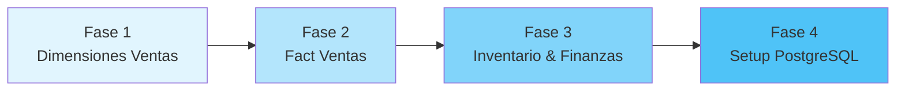

# 🏪 PuntaFina Data Warehouse - Sistema Analítico Empresarial

<div align="center">


**Sistema integral de Data Warehouse para análisis empresarial de ventas, inventario y finanzas**

[Inicio Rápido](#-inicio-rápido) •
[Documentación](#-documentación) •
[Arquitectura](#-arquitectura-del-sistema) •
[Instalación](#-instalación-paso-a-paso) •
[Uso](#-guía-de-uso)

</div>

---

## 📊 Descripción del Proyecto

**PuntaFina Data Warehouse** es una solución analítica completa diseñada para **PuntaFina**, empresa salvadoreña de venta de calzado con **5 tiendas físicas + 1 tienda en línea**. El sistema integra datos de **OroCRM y OroCommerce** en un modelo dimensional optimizado para análisis de negocio.

### 🎯 Problema que Resuelve

| Antes | Después |
|-------|---------|
| ❌ Sin reportes predefinidos en OroCRM/OroCommerce | ✅ Reportes automatizados en tiempo real |
| ❌ Descarga manual de datos a Excel | ✅ ETL automatizado con validaciones |
| ❌ Análisis disperso y sin integración | ✅ Modelo dimensional integrado |
| ❌ KPIs calculados manualmente | ✅ Métricas precalculadas y validadas |
| ❌ Decisiones basadas en intuición | ✅ Decisiones basadas en datos |

### ✨ Versión Actual: 2.1

- ✅ **Módulo de Ventas** - 13 dimensiones + 1 fact (30K registros)
- ✅ **Módulo de Inventario** - 6 dimensiones + 1 fact (100K movimientos)
- ✅ **Módulo de Finanzas** - 5 dimensiones + 3 facts (200K transacciones)
- ✅ **Estados Completos** - Órdenes, pagos y envíos (36 estados)
- ✅ **Integración Total** - 3 dimensiones conformadas compartidas
- ✅ **CSVs de Ejemplo** - 12 archivos con 2,142+ registros

---

## 🎯 Objetivos y Casos de Uso

### 💼 Decisiones de Negocio Habilitadas

<details open>
<summary><b>📈 Análisis de Ventas</b></summary>

- ✅ Ventas diarias, mensuales y anuales por tienda
- ✅ Productos más vendidos por categoría y temporada
- ✅ Clientes VIP y análisis de segmentación
- ✅ Efectividad de promociones y descuentos
- ✅ Análisis de conversión por canal (online vs. tiendas físicas)
- ✅ Tendencias de venta por ubicación geográfica

</details>

<details>
<summary><b>📦 Gestión de Inventario</b></summary>

- ✅ Stock actual por producto y almacén
- ✅ Rotación de inventario y días de stock
- ✅ Costos de inventario (FIFO, promedio ponderado)
- ✅ Productos con bajo stock o sobrestock
- ✅ Valoración de inventario mensual
- ✅ Análisis de proveedores y tiempos de reabastecimiento

</details>

<details>
<summary><b>💰 Análisis Financiero</b></summary>

- ✅ Estado de Resultados mensual/anual
- ✅ Balance General a cualquier fecha
- ✅ Margen bruto y margen neto por producto
- ✅ Análisis de costos por centro de costo
- ✅ Flujo de caja y liquidez
- ✅ Ratios financieros (ROA, ROE, razón corriente)

</details>

<details>
<summary><b>🔗 Análisis Integrado</b></summary>

- ✅ Costo de productos vendidos (Ventas ↔ Inventario)
- ✅ Rentabilidad por producto (Ventas ↔ Finanzas)
- ✅ Eficiencia operativa por tienda (Ventas ↔ Inventario ↔ Finanzas)
- ✅ Análisis de márgenes reales considerando todos los costos

</details>

### 📊 KPIs Principales del Sistema

| Módulo | KPI | Fórmula | Uso |
|--------|-----|---------|-----|
| **Ventas** | Ticket Promedio | Total Ventas / # Órdenes | Medir valor promedio de compra |
| **Ventas** | Tasa de Conversión | Órdenes Completadas / Órdenes Abiertas | Eficiencia del proceso de venta |
| **Ventas** | Cumplimiento de Meta | Ventas Reales / Meta Mensual × 100 | Seguimiento de objetivos |
| **Inventario** | Rotación de Inventario | Costo Ventas / Inventario Promedio | Eficiencia de gestión de stock |
| **Inventario** | Días de Inventario | 365 / Rotación de Inventario | Liquidez del inventario |
| **Inventario** | Costo Promedio Inventario | Σ(Stock × Costo) / Mes | Valoración mensual |
| **Finanzas** | Margen Bruto | (Ventas - Costo Ventas) / Ventas × 100 | Rentabilidad operativa |
| **Finanzas** | Margen Neto | Utilidad Neta / Ventas × 100 | Rentabilidad final |
| **Finanzas** | Razón Corriente | Activo Corriente / Pasivo Corriente | Liquidez empresarial |
| **Integrado** | ROI por Producto | (Ingresos - Costos) / Costos × 100 | Rentabilidad por SKU |

---

## 🏗️ Arquitectura del Sistema

### 📐 Modelo Dimensional - Vista General

El sistema implementa un **Esquema Estrella Conformado** con **20 dimensiones** y **5 tablas de hechos**, optimizado para consultas analíticas de alta performance.

```
┌─────────────────────────────────────────────────────────────────────┐
│                    ARQUITECTURA DATA WAREHOUSE                      │
│                         PuntaFina DW v2.1                           │
└─────────────────────────────────────────────────────────────────────┘

                    ┌─────────────────────┐
                    │   DIMENSIONES       │
                    │   CONFORMADAS       │
                    │  (Compartidas)      │
                    └─────────────────────┘
                            │
            ┌───────────────┼───────────────┐
            │               │               │
       dim_fecha      dim_producto    dim_usuario
            │               │               │
    ┌───────┼───────┐      │       ┌───────┼───────┐
    │       │       │      │       │       │       │
    │       │       │      │       │       │       │
┌───┴───┐   │   ┌───┴───┐  │   ┌───┴───┐   │   ┌───┴───┐
│VENTAS │◄──┼──►│INVENT.│◄─┼──►│FINANZ.│◄──┼──►│TODOS  │
│       │   │   │       │  │   │       │   │   │       │
│13 dim │   │   │ 6 dim │  │   │ 5 dim │   │   │3 dim  │
│1 fact │   │   │1 fact │  │   │3 facts│   │   │compar.│
└───────┘   │   └───────┘  │   └───────┘   │   └───────┘
    │       │       │      │       │       │       │
    └───────┴───────┴──────┴───────┴───────┴───────┘
                    │
            ┌───────┴────────┐
            │                │
    ┌───────▼────────┐   ┌──▼──────────┐
    │  PostgreSQL    │   │  Archivos   │
    │  Data Warehouse│   │  Parquet    │
    │  (OLAP)        │   │  + CSV      │
    └────────────────┘   └─────────────┘
```

### 🗂️ Estructura de Tablas Completa

#### 📦 Módulo VENTAS (13 dimensiones + 1 fact)

<details open>
<summary><b>Ver Dimensiones de Ventas</b></summary>

| # | Tabla | Registros | Descripción | Fuente |
|---|-------|-----------|-------------|--------|
| 1 | **dim_cliente** | ~500 | Clientes únicos con información de contacto | oro_customer |
| 2 | **dim_producto** 🔗 | ~200 | Catálogo de productos de calzado | oro_product |
| 3 | **dim_usuario** 🔗 | ~20 | Usuarios del sistema (vendedores, admin) | oro_user |
| 4 | **dim_sitio_web** | ~3 | Sitios web y canales de venta | oro_website |
| 5 | **dim_canal** | ~4 | Canales de venta (online/tienda física) | oro_channel |
| 6 | **dim_direccion** | ~1K | Direcciones de envío y facturación | oro_address |
| 7 | **dim_envio** | ~8 | Métodos de envío con estados | CSV: metodos_envio.csv |
| 8 | **dim_pago** | ~12 | Métodos y estados de pago | CSV: estados_pago.csv |
| 9 | **dim_estado_orden** | ~16 | Estados de orden (flujo completo) | CSV: estados_orden.csv |
| 10 | **dim_impuestos** | ~10 | Configuración fiscal (IVA, etc.) | oro_tax |
| 11 | **dim_promocion** | ~15 | Promociones y descuentos | oro_promotion |
| 12 | **dim_orden** | ~1K | Órdenes con información desnormalizada | oro_order |
| 13 | **dim_line_item** | ~5K | Ítems de línea de pedidos | oro_order_line_item |

**Tabla de Hechos:**
- **fact_ventas** (~30K registros) - Transacciones de venta a nivel de línea de pedido

</details>

#### 📦 Módulo INVENTARIO (6 dimensiones + 1 fact)

<details>
<summary><b>Ver Dimensiones de Inventario</b></summary>

**Dimensiones Propias:**

| # | Tabla | Registros | Descripción | Fuente |
|---|-------|-----------|-------------|--------|
| 14 | **dim_proveedor** | ~10 | Proveedores de calzado | CSV: proveedores.csv |
| 15 | **dim_almacen** | ~6 | Almacenes y tiendas físicas | CSV: almacenes.csv |
| 16 | **dim_movimiento_tipo** | ~9 | Tipos de movimiento (entrada/salida) | CSV: tipos_movimiento.csv |

**Dimensiones Compartidas:**
- 🔗 **dim_producto** (compartida con Ventas)
- 🔗 **dim_usuario** (compartida con Ventas y Finanzas)
- 🔗 **dim_fecha** (compartida con todos)

**Tabla de Hechos:**
- **fact_inventario** (~100K registros) - Movimientos de inventario con stock y costos

</details>

#### 📦 Módulo FINANZAS (5 dimensiones + 3 facts)

<details>
<summary><b>Ver Dimensiones de Finanzas</b></summary>

**Dimensiones Propias:**

| # | Tabla | Registros | Descripción | Fuente |
|---|-------|-----------|-------------|--------|
| 17 | **dim_cuenta_contable** | ~40 | Plan de cuentas contable | CSV: cuentas_contables.csv |
| 18 | **dim_centro_costo** | ~9 | Centros de costo organizacionales | CSV: centros_costo.csv |
| 19 | **dim_tipo_transaccion** | ~9 | Tipos de transacción contable | CSV: tipos_transaccion.csv |

**Dimensiones Compartidas:**
- 🔗 **dim_usuario** (compartida con Ventas e Inventario)
- 🔗 **dim_fecha** (compartida con todos)

**Tablas de Hechos:**
- **fact_transacciones_contables** (~200K registros) - Asientos contables detallados
- **fact_estado_resultados** (~1K registros) - Estado de resultados agregado mensual
- **fact_balance_general** (~2K registros) - Balance general a fecha de corte

</details>

#### 🔗 Dimensión Especial: dim_fecha

<details>
<summary><b>Ver Estructura de dim_fecha</b></summary>

**dim_fecha** es una dimensión conformada compartida por TODOS los módulos.

| Campo | Tipo | Descripción | Ejemplo |
|-------|------|-------------|---------|
| id_fecha | TEXT | YYYYMMDD | 20240115 |
| fecha | DATE | Fecha completa | 2024-01-15 |
| año | INTEGER | Año | 2024 |
| mes | INTEGER | Mes (1-12) | 1 |
| dia | INTEGER | Día del mes | 15 |
| nombre_mes | TEXT | Nombre del mes | Enero |
| trimestre | INTEGER | Trimestre (1-4) | 1 |
| dia_semana | INTEGER | Día de la semana (1-7) | 1 |
| nombre_dia | TEXT | Nombre del día | Lunes |
| es_fin_semana | BOOLEAN | TRUE si sábado/domingo | FALSE |
| es_feriado | BOOLEAN | TRUE si es feriado | FALSE |
| nombre_feriado | TEXT | Nombre del feriado | - |
| semana_año | INTEGER | Semana del año (1-53) | 3 |

**Rango:** 2020-01-01 a 2030-12-31 (~4,000 registros)

</details>

### 🎯 Dimensiones Conformadas (Conformed Dimensions)

Las **dimensiones conformadas** son dimensiones compartidas entre múltiples módulos, garantizando consistencia y permitiendo análisis integrado:

| Dimensión | Módulos | Beneficio |
|-----------|---------|-----------|
| 🔗 **dim_producto** | Ventas + Inventario | Analizar ventas vs. inventario del mismo producto |
| 🔗 **dim_usuario** | Ventas + Inventario + Finanzas | Rastrear actividad de usuarios en todo el sistema |
| 🔗 **dim_fecha** | Todos los módulos | Análisis temporal consistente en todo el DW |

**Ejemplo de consulta usando dimensión conformada:**

```sql
-- Análisis de rentabilidad por producto (Ventas + Inventario)
SELECT 
    p.nombre,
    p.sku,
    SUM(v.cantidad) as unidades_vendidas,
    SUM(v.total_linea_neto) as ingresos,
    AVG(i.costo_unitario) as costo_promedio,
    SUM(v.total_linea_neto) - (SUM(v.cantidad) * AVG(i.costo_unitario)) as utilidad
FROM fact_ventas v
JOIN dim_producto p ON v.id_producto = p.id_producto  -- Dimensión conformada
JOIN fact_inventario i ON i.id_producto = p.id_producto
WHERE v.id_fecha >= '20240101'
GROUP BY p.id_producto, p.nombre, p.sku
ORDER BY utilidad DESC;
```

---


## 📋 Estructura Detallada de Tablas del Data Warehouse

Esta sección documenta la estructura completa de cada dimensión y tabla de hechos del Data Warehouse, incluyendo todos los campos, tipos de datos, claves primarias/foráneas y propósito.

---

## 🛒 MÓDULO VENTAS

### 📅 dim_fecha (CONFORMADA - Compartida entre los 3 módulos)
**Módulo:** VENTAS | INVENTARIO | FINANZAS  
**Origen:** CSV generado desde scripts/data/inputs/dim_fechas.csv  
**Propósito:** Dimensión temporal para análisis históricos y tendencias

| Campo | Tipo | Clave | Descripción |
|-------|------|-------|-------------|
| id_fecha | BIGINT | PK | ID en formato YYYYMMDD (ej: 20241216) |
| fecha | DATE | - | Fecha completa |
| año | INTEGER | - | Año (2024) |
| mes | INTEGER | - | Mes (1-12) |
| dia | INTEGER | - | Día del mes (1-31) |
| dia_semana | INTEGER | - | Día de semana (1=Lun, 7=Dom) |
| nombre_dia | VARCHAR(20) | - | Nombre del día (Lunes, Martes...) |
| nombre_mes | VARCHAR(20) | - | Nombre del mes (Enero, Febrero...) |
| trimestre | INTEGER | - | Trimestre (1-4) |
| semana_año | INTEGER | - | Semana del año (1-52/53) |
| es_fin_semana | BOOLEAN | - | True si es sábado/domingo |
| es_feriado | BOOLEAN | - | True si es feriado nacional |

---

### 👤 dim_cliente
**Módulo:** VENTAS  
**Origen:** oro_customer (OroCommerce)  
**Propósito:** Clientes B2B con información organizacional

| Campo | Tipo | Clave | Descripción |
|-------|------|-------|-------------|
| id_cliente | TEXT | PK | ID único del cliente |
| nombre | TEXT | - | Razón social del cliente |
| id_sitio_web | TEXT | - | Website asociado |
| tipo_cliente | TEXT | - | B2B, B2C, Mayorista, etc. |
| estado | TEXT | - | activo, inactivo, bloqueado |
| fecha_registro | DATE | - | Fecha de creación del cliente |

---

### 📦 dim_producto (CONFORMADA - Compartida entre Ventas e Inventario)
**Módulo:** VENTAS | INVENTARIO  
**Origen:** oro_product + métricas calculadas desde fact_ventas y fact_inventario  
**Propósito:** Catálogo de productos enriquecido con KPIs de stock y rentabilidad

| Campo | Tipo | Clave | Descripción |
|-------|------|-------|-------------|
| id_producto | TEXT | PK | ID único del producto |
| sku | TEXT | - | Código SKU único |
| nombre | TEXT | - | Nombre del producto |
| descripcion | TEXT | - | Descripción detallada |
| unidad_medida | TEXT | - | Unidad (pza, kg, litro, etc.) |
| estado | TEXT | - | enabled, disabled |
| fecha_creacion | DATE | - | Fecha de creación |
| **stock_inicial** | INTEGER | - | Stock al inicio del período |
| **total_compras** | INTEGER | - | Total unidades compradas |
| **total_ventas** | INTEGER | - | Total unidades vendidas |
| **stock_actual** | INTEGER | - | Stock disponible actual |
| **nivel_stock** | TEXT | - | Sin Stock, Bajo, Óptimo, Alto |
| **alerta_stock** | TEXT | - | Sin Datos, Normal, Crítico |
| **rotacion_stock** | DECIMAL(10,2) | - | Índice de rotación |
| **precio_compra_promedio** | DECIMAL(10,2) | - | Precio promedio de compra USD |
| **precio_venta_promedio** | DECIMAL(10,2) | - | Precio promedio de venta USD |
| **margen_unitario_usd** | DECIMAL(10,2) | - | Margen por unidad vendida |
| **margen_porcentaje** | DECIMAL(5,1) | - | Margen en % |
| **valor_stock_actual_usd** | DECIMAL(12,2) | - | Valor del stock actual |
| **inversion_total_usd** | DECIMAL(12,2) | - | Total invertido en compras |
| **ingresos_totales_usd** | DECIMAL(12,2) | - | Total ingresos por ventas |
| **roi_porcentaje** | DECIMAL(8,1) | - | Return on Investment % |
| **fecha_ultimo_calculo** | TIMESTAMP | - | Timestamp del último cálculo |

---

### 👨‍💼 dim_usuario (CONFORMADA - Compartida entre los 3 módulos)
**Módulo:** VENTAS | INVENTARIO | FINANZAS  
**Origen:** oro_user (OroCommerce)  
**Propósito:** Usuarios del sistema para auditoría y responsables

| Campo | Tipo | Clave | Descripción |
|-------|------|-------|-------------|
| id_usuario | TEXT | PK | ID único del usuario |
| username | TEXT | - | Nombre de usuario |
| email | TEXT | - | Correo electrónico |
| nombre | TEXT | - | Primer nombre |
| apellido | TEXT | - | Apellido |
| nombre_completo | TEXT | - | Nombre completo concatenado |
| estado | TEXT | - | activo, inactivo |
| fecha_creacion | DATE | - | Fecha de creación |

---

### 🌐 dim_sitio_web
**Módulo:** VENTAS  
**Origen:** oro_website (OroCommerce)  
**Propósito:** Websites/tiendas online donde se generan las ventas

| Campo | Tipo | Clave | Descripción |
|-------|------|-------|-------------|
| id_sitio_web | TEXT | PK | ID único del sitio web |
| nombre | TEXT | - | Nombre del sitio |
| url | TEXT | - | URL del sitio web |
| estado | TEXT | - | activo, inactivo |
| fecha_creacion | DATE | - | Fecha de creación |

---

### 📡 dim_canal
**Módulo:** VENTAS  
**Origen:** orocrm_channel (OroCRM)  
**Propósito:** Canales de venta (B2B, Magento, custom)

| Campo | Tipo | Clave | Descripción |
|-------|------|-------|-------------|
| id_canal | TEXT | PK | ID único del canal |
| nombre | TEXT | - | Nombre del canal |
| tipo | TEXT | - | b2b, magento, custom |
| estado | TEXT | - | activo, inactivo |

---

### 📍 dim_direccion
**Módulo:** VENTAS  
**Origen:** oro_address (OroCommerce)  
**Propósito:** Direcciones de envío y facturación

| Campo | Tipo | Clave | Descripción |
|-------|------|-------|-------------|
| id_direccion | TEXT | PK | ID único de dirección |
| calle | TEXT | - | Dirección de calle |
| ciudad | TEXT | - | Ciudad |
| codigo_postal | TEXT | - | Código postal |
| region | TEXT | - | Región/Estado |
| pais_codigo | TEXT | - | Código ISO del país |
| direccion_completa | TEXT | - | Dirección formateada completa |
| estado | TEXT | - | activo, inactivo |

---

### 🚚 dim_envio
**Módulo:** VENTAS  
**Origen:** CSV maestro (data/inputs/ventas/metodos_envio.csv)  
**Propósito:** Métodos de envío con costos y tiempos

| Campo | Tipo | Clave | Descripción |
|-------|------|-------|-------------|
| id_envio | TEXT | PK | ID único del método de envío |
| metodo_envio | TEXT | - | Standard, Express, Same Day, etc. |
| tiempo_entrega | TEXT | - | 3-5 días, 24h, etc. |
| costo | NUMERIC(10,2) | - | Costo del envío en USD |
| estado | TEXT | - | activo, inactivo |

---

### 💳 dim_pago
**Módulo:** VENTAS  
**Origen:** CSV maestro (data/inputs/ventas/estados_pago.csv)  
**Propósito:** Métodos y estados de pago

| Campo | Tipo | Clave | Descripción |
|-------|------|-------|-------------|
| id_pago | TEXT | PK | ID único del método de pago |
| metodo_pago | TEXT | - | Tarjeta, Transferencia, Efectivo |
| estado_pago | TEXT | - | Pendiente, Autorizado, Pagado |
| descripcion | TEXT | - | Descripción del estado |
| requiere_validacion | BOOLEAN | - | Si requiere validación manual |
| plazo_dias | INTEGER | - | Plazo de pago en días |

---

### 📋 dim_estado_orden
**Módulo:** VENTAS  
**Origen:** CSV maestro (data/inputs/ventas/estados_orden.csv)  
**Propósito:** Estados del flujo de órdenes

| Campo | Tipo | Clave | Descripción |
|-------|------|-------|-------------|
| id_estado_orden | TEXT | PK | ID único del estado |
| codigo_estado | TEXT | - | pending, processing, shipped, etc. |
| nombre_estado | TEXT | - | Nombre legible del estado |
| descripcion | TEXT | - | Descripción detallada |
| orden_flujo | INTEGER | - | Orden secuencial (1, 2, 3...) |
| es_estado_final | BOOLEAN | - | True si es estado terminal |
| permite_modificacion | BOOLEAN | - | Si permite editar la orden |

---

### 💰 dim_impuestos
**Módulo:** VENTAS  
**Origen:** oro_tax (OroCommerce)  
**Propósito:** Configuración de impuestos y tasas

| Campo | Tipo | Clave | Descripción |
|-------|------|-------|-------------|
| id_impuestos | TEXT | PK | ID único del impuesto |
| codigo_impuesto | TEXT | - | IVA, ISR, etc. |
| descripcion | TEXT | - | Descripción del impuesto |
| tasa | NUMERIC(5,4) | - | Tasa decimal (ej: 0.16 = 16%) |
| estado | TEXT | - | activo, inactivo |

---

### 🎁 dim_promocion
**Módulo:** VENTAS  
**Origen:** oro_promotion (OroCommerce)  
**Propósito:** Promociones y descuentos aplicados

| Campo | Tipo | Clave | Descripción |
|-------|------|-------|-------------|
| id_promocion | TEXT | PK | ID único de promoción |
| nombre_promocion | TEXT | - | Nombre de la promoción |
| descripcion | TEXT | - | Descripción de la oferta |
| descuento_monto | NUMERIC(10,2) | - | Monto del descuento |
| tipo_descuento | TEXT | - | porcentaje, monto_fijo |
| estado | TEXT | - | activo, inactivo, expirado |

---

### 📄 dim_orden
**Módulo:** VENTAS  
**Origen:** oro_order (OroCommerce) - Desnormalizada  
**Propósito:** Órdenes de venta con información agregada

| Campo | Tipo | Clave | Descripción |
|-------|------|-------|-------------|
| id_orden | TEXT | PK | ID único de la orden |
| numero_orden | TEXT | - | Número de orden visible |
| numero_po | TEXT | - | Purchase Order del cliente |
| cliente_nombre | TEXT | - | Nombre del cliente |
| usuario_nombre_completo | TEXT | - | Nombre del usuario responsable |
| sitio_web_nombre | TEXT | - | Nombre del website |
| subtotal | NUMERIC(15,2) | - | Subtotal sin impuestos |
| total | NUMERIC(15,2) | - | Total incluyendo todo |
| moneda | TEXT | - | USD, EUR, etc. |
| fecha_orden | DATE | - | Fecha de creación |
| fecha_actualizacion | DATE | - | Última actualización |
| categoria_orden | TEXT | - | Retail, Wholesale, etc. |

---

### 📝 dim_line_item
**Módulo:** VENTAS  
**Origen:** oro_order_line_item + oro_inventory_level  
**Propósito:** Líneas de pedido individuales con stock

| Campo | Tipo | Clave | Descripción |
|-------|------|-------|-------------|
| id_line_item | TEXT | PK | ID único del line item |
| id_orden | TEXT | - | ID de la orden padre |
| id_producto | TEXT | - | ID del producto |
| producto_sku | TEXT | - | SKU del producto |
| producto_nombre | TEXT | - | Nombre del producto |
| cantidad | NUMERIC(10,2) | - | Cantidad solicitada |
| precio_unitario | NUMERIC(10,2) | - | Precio unitario |
| total_linea | NUMERIC(15,2) | - | Total de la línea |
| moneda | TEXT | - | USD, EUR, etc. |
| unidad | TEXT | - | Unidad de medida |
| stock_actual | NUMERIC(10,2) | - | Stock al momento de la venta |
| stock_disponible | NUMERIC(10,2) | - | Stock disponible para venta |
| stock_despues_venta | NUMERIC(10,2) | - | Stock resultante post-venta |
| estado_stock | TEXT | - | Suficiente, Insuficiente, etc. |

---

### 📊 fact_ventas (TABLA DE HECHOS)
**Módulo:** VENTAS  
**Granularidad:** 1 fila por cada producto en una orden  
**Origen:** Combinación de oro_order + oro_order_line_item + 13 dimensiones  
**Propósito:** Registro detallado de todas las ventas con métricas clave

| Campo | Tipo | Clave | Descripción |
|-------|------|-------|-------------|
| id_venta | SERIAL | PK | ID autoincremental de la venta |
| id_line_item | TEXT | FK | → dim_line_item |
| id_order | TEXT | FK | → dim_orden |
| id_cliente | TEXT | FK | → dim_cliente |
| id_producto | TEXT | FK | → dim_producto |
| id_usuario | TEXT | FK | → dim_usuario |
| id_sitio_web | TEXT | FK | → dim_sitio_web |
| id_fecha | BIGINT | FK | → dim_fecha |
| id_promocion | TEXT | FK | → dim_promocion |
| id_canal | TEXT | FK | → dim_canal |
| id_direccion | TEXT | FK | → dim_direccion |
| id_envio | TEXT | FK | → dim_envio |
| id_impuestos | TEXT | FK | → dim_impuestos |
| id_pago | TEXT | FK | → dim_pago |
| id_status_pago | TEXT | - | Estado de pago en ese momento |
| id_metodo_pago | TEXT | - | Método de pago utilizado |
| **cantidad** | NUMERIC(10,2) | **MEDIDA** | Cantidad vendida |
| **precio_unitario** | NUMERIC(10,2) | **MEDIDA** | Precio por unidad |
| **total_linea** | NUMERIC(15,2) | **MEDIDA** | Total de la línea (cantidad × precio) |
| **subtotal_orden** | NUMERIC(15,2) | **MEDIDA** | Subtotal de toda la orden |
| **total_orden** | NUMERIC(15,2) | **MEDIDA** | Total de toda la orden |
| **descuento_promocion** | NUMERIC(15,2) | **MEDIDA** | Descuento aplicado |
| **fecha_venta** | TIMESTAMP | - | Timestamp exacto de la venta |
| moneda | TEXT | - | Moneda de la transacción |
| numero_po | TEXT | - | Purchase Order |
| numero_orden | TEXT | - | Número de orden |
| **stock_actual** | NUMERIC(10,2) | **MEDIDA** | Stock al momento de venta |
| **stock_inicial** | NUMERIC(10,2) | **MEDIDA** | Stock antes de venta |
| **stock_restante** | NUMERIC(10,2) | **MEDIDA** | Stock después de venta |
| **total_linea_neto** | NUMERIC(15,2) | **MEDIDA** | Total neto (sin descuentos) |

**Constraint Único:** (id_line_item, id_order)

---

## 📦 MÓDULO INVENTARIO

### 🏢 dim_proveedor
**Módulo:** INVENTARIO  
**Origen:** CSV maestro (data/inputs/inventario/proveedores.csv)  
**Propósito:** Proveedores de productos con datos comerciales

| Campo | Tipo | Clave | Descripción |
|-------|------|-------|-------------|
| id_proveedor | TEXT | PK | ID único del proveedor |
| nombre_proveedor | TEXT | - | Nombre comercial |
| razon_social | TEXT | - | Razón social legal |
| nit | TEXT | - | NIT o RUC |
| pais_origen | TEXT | - | País de origen |
| ciudad | TEXT | - | Ciudad |
| direccion | TEXT | - | Dirección completa |
| telefono | TEXT | - | Teléfono de contacto |
| email | TEXT | - | Email de contacto |
| contacto_principal | TEXT | - | Nombre del contacto |
| dias_credito | INTEGER | - | Días de crédito otorgados |
| tipo_proveedor | TEXT | - | Nacional, Internacional |
| categoria_productos | TEXT | - | Categoría de productos |
| activo | BOOLEAN | - | True si está activo |
| fecha_registro | DATE | - | Fecha de alta |

---

### 🏭 dim_almacen
**Módulo:** INVENTARIO  
**Origen:** CSV maestro (data/inputs/inventario/almacenes.csv)  
**Propósito:** Almacenes y centros de distribución

| Campo | Tipo | Clave | Descripción |
|-------|------|-------|-------------|
| id_almacen | TEXT | PK | ID único del almacén |
| nombre_almacen | TEXT | - | Nombre del almacén |
| tipo_almacen | TEXT | - | Principal, Secundario, Tránsito |
| ciudad | TEXT | - | Ciudad ubicación |
| departamento | TEXT | - | Departamento/Estado |
| direccion | TEXT | - | Dirección completa |
| capacidad_m3 | NUMERIC(10,2) | - | Capacidad en metros cúbicos |
| encargado | TEXT | - | Responsable del almacén |
| telefono | TEXT | - | Teléfono de contacto |
| activo | BOOLEAN | - | True si está activo |
| fecha_apertura | DATE | - | Fecha de apertura |

---

### 🔄 dim_movimiento_tipo
**Módulo:** INVENTARIO  
**Origen:** CSV maestro (data/inputs/inventario/tipos_movimiento.csv)  
**Propósito:** Tipos de movimientos de inventario

| Campo | Tipo | Clave | Descripción |
|-------|------|-------|-------------|
| id_tipo_movimiento | TEXT | PK | ID único del tipo |
| nombre_tipo | TEXT | - | Compra, Venta, Ajuste, Traslado |
| categoria | TEXT | - | Entrada, Salida, Ajuste |
| afecta_stock | TEXT | - | Incrementa, Decrementa, Neutral |
| descripcion | TEXT | - | Descripción detallada |

---

### 📈 fact_inventario (TABLA DE HECHOS)
**Módulo:** INVENTARIO  
**Granularidad:** 1 fila por cada movimiento de inventario  
**Origen:** Calculado desde fact_ventas + movimientos manuales  
**Propósito:** Registro de todos los movimientos de stock

| Campo | Tipo | Clave | Descripción |
|-------|------|-------|-------------|
| id_movimiento | SERIAL | PK | ID autoincremental del movimiento |
| id_producto | TEXT | FK | → dim_producto |
| id_almacen | TEXT | FK | → dim_almacen |
| id_proveedor | TEXT | FK | → dim_proveedor (nullable) |
| id_tipo_movimiento | TEXT | FK | → dim_movimiento_tipo |
| id_fecha | BIGINT | FK | → dim_fecha |
| id_usuario | TEXT | FK | → dim_usuario (nullable) |
| numero_documento | TEXT | - | Número de documento (factura, guía) |
| **cantidad** | NUMERIC(10,2) | **MEDIDA** | Cantidad movida (+ o -) |
| **costo_unitario** | NUMERIC(10,2) | **MEDIDA** | Costo por unidad |
| **costo_total** | NUMERIC(15,2) | **MEDIDA** | Costo total del movimiento |
| **stock_anterior** | NUMERIC(10,2) | **MEDIDA** | Stock antes del movimiento |
| **stock_resultante** | NUMERIC(10,2) | **MEDIDA** | Stock después del movimiento |
| motivo | TEXT | - | Motivo del movimiento |
| observaciones | TEXT | - | Observaciones adicionales |
| año | INTEGER | - | Año del movimiento |
| mes | INTEGER | - | Mes del movimiento |
| dia | INTEGER | - | Día del movimiento |

---

## 💰 MÓDULO FINANZAS

### 📊 dim_cuenta_contable
**Módulo:** FINANZAS  
**Origen:** CSV maestro (data/inputs/finanzas/cuentas_contables.csv)  
**Propósito:** Plan de cuentas contable jerárquico

| Campo | Tipo | Clave | Descripción |
|-------|------|-------|-------------|
| id_cuenta | TEXT | PK | Código de cuenta (1.1.01, 2.1.01) |
| nombre_cuenta | TEXT | - | Nombre de la cuenta |
| tipo_cuenta | TEXT | - | Activo, Pasivo, Patrimonio, etc. |
| clasificacion | TEXT | - | Corriente, No Corriente |
| cuenta_padre | TEXT | - | Cuenta padre en jerarquía |
| nivel | INTEGER | - | Nivel en jerarquía (1, 2, 3, 4) |
| naturaleza | TEXT | - | Deudora, Acreedora |
| acepta_movimientos | BOOLEAN | - | True si acepta asientos |
| estado_financiero | TEXT | - | Balance, Estado Resultados |
| descripcion | TEXT | - | Descripción detallada |
| activa | BOOLEAN | - | True si está activa |

---

### 🏢 dim_centro_costo
**Módulo:** FINANZAS  
**Origen:** CSV maestro (data/inputs/finanzas/centros_costo.csv)  
**Propósito:** Centros de costo para asignación de gastos

| Campo | Tipo | Clave | Descripción |
|-------|------|-------|-------------|
| id_centro_costo | TEXT | PK | ID único del centro |
| nombre_centro | TEXT | - | Nombre del centro de costo |
| tipo_centro | TEXT | - | Operativo, Administrativo, Ventas |
| responsable | TEXT | - | Responsable del centro |
| activo | BOOLEAN | - | True si está activo |

---

### 💼 dim_tipo_transaccion
**Módulo:** FINANZAS  
**Origen:** CSV maestro (data/inputs/finanzas/tipos_transaccion.csv)  
**Propósito:** Clasificación de transacciones contables

| Campo | Tipo | Clave | Descripción |
|-------|------|-------|-------------|
| id_tipo_transaccion | TEXT | PK | ID único del tipo |
| nombre_tipo | TEXT | - | Venta, Compra, Ajuste, etc. |
| categoria | TEXT | - | Ingreso, Egreso, Traspaso |
| descripcion | TEXT | - | Descripción detallada |

---

### 📚 fact_transacciones_contables (TABLA DE HECHOS)
**Módulo:** FINANZAS  
**Granularidad:** 1 fila por cada asiento contable (debe o haber)  
**Origen:** Generado automáticamente desde fact_ventas y fact_inventario  
**Propósito:** Registro de todos los asientos contables

| Campo | Tipo | Clave | Descripción |
|-------|------|-------|-------------|
| id_asiento | SERIAL | PK | ID autoincremental del asiento |
| numero_asiento | TEXT | - | Número correlativo del asiento |
| id_fecha | BIGINT | FK | → dim_fecha |
| id_cuenta | TEXT | FK | → dim_cuenta_contable |
| id_centro_costo | TEXT | FK | → dim_centro_costo (nullable) |
| id_tipo_transaccion | TEXT | FK | → dim_tipo_transaccion |
| id_usuario | TEXT | FK | → dim_usuario (nullable) |
| tipo_movimiento | TEXT | - | 'debe' o 'haber' |
| **monto** | NUMERIC(15,2) | **MEDIDA** | Monto del asiento |
| documento_referencia | TEXT | - | Número de documento |
| descripcion | TEXT | - | Descripción del asiento |
| id_venta | TEXT | - | Referencia a fact_ventas |
| id_movimiento_inventario | TEXT | - | Referencia a fact_inventario |
| observaciones | TEXT | - | Observaciones adicionales |
| año | INTEGER | - | Año contable |
| mes | INTEGER | - | Mes contable |

**Constraint:** tipo_movimiento IN ('debe', 'haber')

---

### 📊 fact_estado_resultados (TABLA DE HECHOS)
**Módulo:** FINANZAS  
**Granularidad:** 1 fila por cuenta contable por mes  
**Origen:** Agregación de fact_transacciones_contables  
**Propósito:** Estado de resultados mensual

| Campo | Tipo | Clave | Descripción |
|-------|------|-------|-------------|
| id_resultado | SERIAL | PK | ID autoincremental |
| año | INTEGER | - | Año del período |
| mes | INTEGER | - | Mes del período |
| id_cuenta | TEXT | FK | → dim_cuenta_contable |
| id_centro_costo | TEXT | FK | → dim_centro_costo (nullable) |
| **monto_debe** | NUMERIC(15,2) | **MEDIDA** | Total débitos del período |
| **monto_haber** | NUMERIC(15,2) | **MEDIDA** | Total créditos del período |
| **saldo_neto** | NUMERIC(15,2) | **MEDIDA** | Saldo neto (haber - debe) |

---

### 🏦 fact_balance_general (TABLA DE HECHOS)
**Módulo:** FINANZAS  
**Granularidad:** 1 fila por cuenta contable por fecha  
**Origen:** Saldos acumulados desde fact_transacciones_contables  
**Propósito:** Balance general al cierre de período

| Campo | Tipo | Clave | Descripción |
|-------|------|-------|-------------|
| id_balance | SERIAL | PK | ID autoincremental |
| id_fecha | BIGINT | FK | → dim_fecha |
| id_cuenta | TEXT | FK | → dim_cuenta_contable |
| **saldo** | NUMERIC(15,2) | **MEDIDA** | Saldo de la cuenta |
| tipo_saldo | TEXT | - | 'deudor' o 'acreedor' |

**Constraint:** tipo_saldo IN ('deudor', 'acreedor')

---

## 📊 Resumen de Tablas por Módulo

| Módulo | Dimensiones | Facts | Total Tablas |
|--------|-------------|-------|--------------|
| **VENTAS** | 13 dims | 1 fact | 14 tablas |
| **INVENTARIO** | 3 dims | 1 fact | 4 tablas |
| **FINANZAS** | 3 dims | 3 facts | 6 tablas |
| **CONFORMADAS** | 3 dims compartidas | - | - |
| **TOTAL** | 19 dims + 3 conformadas | 5 facts | **24 tablas** |

---

## 🎯 Diagramas del Modelo Dimensional (Estrella)

Esta sección muestra los modelos dimensionales (esquema estrella) de cada módulo, con las tablas de hechos en el centro y sus dimensiones relacionadas.

---

### 🛒 MÓDULO VENTAS - Modelo Dimensional

**Esquema Estrella:** fact_ventas rodeada de 13 dimensiones + 2 dimensiones desnormalizadas

```
                           ┌─────────────────┐
                           │   dim_fecha     │
                           │  (CONFORMADA)   │
                           └────────┬────────┘
                                    │
                                    │ 1:N
┌──────────────┐                    │                    ┌──────────────┐
│  dim_cliente │                    │                    │ dim_producto │
│              │                    │                    │ (CONFORMADA) │
└──────┬───────┘                    │                    └──────┬───────┘
       │                            │                           │
       │ 1:N                        │                    1:N    │
       │                            │                           │
       │        ┌────────────────┐  │  ┌────────────────┐       │
       │        │  dim_usuario   │  │  │ dim_sitio_web  │       │
       │        │  (CONFORMADA)  │  │  │                │       │
       │        └────────┬───────┘  │  └────────┬───────┘       │
       │                 │          │           │               │
       │                 │ 1:N      │      1:N  │               │
       │                 │          │           │               │
┌──────┴─────────────────┴──────────┴───────────┴───────────────┴──────┐
│                                                                       │
│                          FACT_VENTAS                                 │
│                     (Tabla de Hechos Central)                        │
│                                                                       │
│  Granularidad: 1 producto por orden                                 │
│                                                                       │
│  MEDIDAS CLAVE:                                                      │
│  • cantidad                    NUMERIC(10,2)                         │
│  • precio_unitario             NUMERIC(10,2)                         │
│  • total_linea                 NUMERIC(15,2)                         │
│  • subtotal_orden              NUMERIC(15,2)                         │
│  • total_orden                 NUMERIC(15,2)                         │
│  • descuento_promocion         NUMERIC(15,2)                         │
│  • stock_actual                NUMERIC(10,2)                         │
│  • stock_inicial               NUMERIC(10,2)                         │
│  • stock_restante              NUMERIC(10,2)                         │
│  • total_linea_neto            NUMERIC(15,2)                         │
│                                                                       │
│  DIMENSIONES (13 FKs):                                               │
│  id_cliente → dim_cliente                                            │
│  id_producto → dim_producto                                          │
│  id_usuario → dim_usuario                                            │
│  id_sitio_web → dim_sitio_web                                        │
│  id_fecha → dim_fecha                                                │
│  id_promocion → dim_promocion                                        │
│  id_canal → dim_canal                                                │
│  id_direccion → dim_direccion                                        │
│  id_envio → dim_envio                                                │
│  id_impuestos → dim_impuestos                                        │
│  id_pago → dim_pago                                                  │
│  id_order → dim_orden (desnormalizada)                               │
│  id_line_item → dim_line_item (desnormalizada)                       │
│                                                                       │
└───────┬──────────┬──────────┬──────────┬──────────┬─────────┬────────┘
        │          │          │          │          │         │
   1:N  │     1:N  │     1:N  │     1:N  │     1:N  │    1:N  │    1:N
        │          │          │          │          │         │
        ↓          ↓          ↓          ↓          ↓         ↓
┌───────────┐ ┌─────────┐ ┌──────────┐ ┌─────────┐ ┌────────────┐ ┌──────────┐
│ dim_canal │ │dim_envio│ │ dim_pago │ │dim_impto│ │dim_promoc. │ │dim_direc.│
└───────────┘ └─────────┘ └──────────┘ └─────────┘ └────────────┘ └──────────┘

        ┌────────────────┐            ┌─────────────────┐
        │  dim_orden     │            │ dim_line_item   │
        │ (desnormaliz.) │            │ (desnormaliz.)  │
        └────────────────┘            └─────────────────┘
```

**Características del Modelo de Ventas:**
- ✅ **13 dimensiones** conectadas a la tabla de hechos
- ✅ **10 medidas** para análisis de ventas y stock
- ✅ **3 dimensiones conformadas** compartidas con otros módulos
- ✅ **2 dimensiones desnormalizadas** (dim_orden, dim_line_item) para mejorar performance
- ✅ Permite análisis por: cliente, producto, tiempo, canal, promoción, ubicación

---

### 📦 MÓDULO INVENTARIO - Modelo Dimensional

**Esquema Estrella:** fact_inventario rodeada de 6 dimensiones (3 propias + 3 conformadas)

```
                           ┌─────────────────┐
                           │   dim_fecha     │
                           │  (CONFORMADA)   │
                           └────────┬────────┘
                                    │
                                    │ 1:N
┌──────────────┐                    │                    ┌──────────────┐
│ dim_producto │                    │                    │ dim_almacen  │
│ (CONFORMADA) │                    │                    │              │
└──────┬───────┘                    │                    └──────┬───────┘
       │                            │                           │
       │ 1:N                        │                    1:N    │
       │                            │                           │
       │        ┌────────────────┐  │  ┌────────────────┐       │
       │        │  dim_usuario   │  │  │ dim_proveedor  │       │
       │        │  (CONFORMADA)  │  │  │                │       │
       │        └────────┬───────┘  │  └────────┬───────┘       │
       │                 │          │           │               │
       │                 │ 1:N      │      1:N  │               │
       │                 │          │           │               │
┌──────┴─────────────────┴──────────┴───────────┴───────────────┴──────┐
│                                                                       │
│                       FACT_INVENTARIO                                │
│                     (Tabla de Hechos Central)                        │
│                                                                       │
│  Granularidad: 1 movimiento de inventario                           │
│                                                                       │
│  MEDIDAS CLAVE:                                                      │
│  • cantidad                    NUMERIC(10,2)                         │
│  • costo_unitario              NUMERIC(10,2)                         │
│  • costo_total                 NUMERIC(15,2)                         │
│  • stock_anterior              NUMERIC(10,2)                         │
│  • stock_resultante            NUMERIC(10,2)                         │
│                                                                       │
│  DIMENSIONES (6 FKs):                                                │
│  id_producto → dim_producto (CONFORMADA)                             │
│  id_almacen → dim_almacen                                            │
│  id_proveedor → dim_proveedor (nullable)                             │
│  id_tipo_movimiento → dim_movimiento_tipo                            │
│  id_fecha → dim_fecha (CONFORMADA)                                   │
│  id_usuario → dim_usuario (CONFORMADA, nullable)                     │
│                                                                       │
│  ATRIBUTOS ADICIONALES:                                              │
│  • numero_documento (factura, guía)                                  │
│  • motivo, observaciones                                             │
│  • año, mes, dia (para particionamiento)                             │
│                                                                       │
└────────────────────────────┬──────────────────────────────────────────┘
                             │
                        1:N  │
                             ↓
                     ┌──────────────────┐
                     │ dim_movimiento_  │
                     │      tipo        │
                     │                  │
                     │ • Compra         │
                     │ • Venta          │
                     │ • Ajuste         │
                     │ • Traslado       │
                     │ • Merma          │
                     └──────────────────┘
```

**Características del Modelo de Inventario:**
- ✅ **6 dimensiones** conectadas (3 propias + 3 conformadas)
- ✅ **5 medidas principales** para control de stock
- ✅ **3 dimensiones conformadas** (producto, usuario, fecha)
- ✅ Permite análisis por: producto, almacén, proveedor, tipo de movimiento, tiempo
- ✅ **Trazabilidad completa** de movimientos con stock_anterior y stock_resultante

---

### 💰 MÓDULO FINANZAS - Modelo Dimensional

**Esquema Constelación:** 3 tablas de hechos relacionadas (transacciones, estado resultados, balance)

```
┌─────────────────────────────────────────────────────────────────────┐
│                   FACT_TRANSACCIONES_CONTABLES                      │
│                   (Tabla de Hechos Transaccional)                   │
│                                                                      │
│  Granularidad: 1 asiento contable (debe o haber)                   │
│                                                                      │
│  MEDIDAS CLAVE:                                                     │
│  • monto                       NUMERIC(15,2)                        │
│  • tipo_movimiento             'debe' | 'haber'                     │
│                                                                      │
│  DIMENSIONES (5 FKs):                                               │
│  id_fecha → dim_fecha (CONFORMADA)                                  │
│  id_cuenta → dim_cuenta_contable                                    │
│  id_centro_costo → dim_centro_costo (nullable)                      │
│  id_tipo_transaccion → dim_tipo_transaccion                         │
│  id_usuario → dim_usuario (CONFORMADA, nullable)                    │
│                                                                      │
│  REFERENCIAS CRUZADAS:                                              │
│  • id_venta → fact_ventas                                           │
│  • id_movimiento_inventario → fact_inventario                       │
│                                                                      │
└────┬──────────────┬──────────────┬──────────────┬───────────────────┘
     │              │              │              │
     │ 1:N          │ 1:N          │ 1:N          │ 1:N
     │              │              │              │
     ↓              ↓              ↓              ↓
┌─────────┐  ┌──────────────┐  ┌─────────────┐  ┌────────────┐
│dim_fecha│  │ dim_cuenta_  │  │dim_centro_  │  │ dim_tipo_  │
│(CONFORM)│  │   contable   │  │    costo    │  │transaccion │
└─────────┘  └──────┬───────┘  └─────────────┘  └────────────┘
                    │
                    │ Jerarquía
                    │ Niveles 1-4
                    ↓
            ┌───────────────┐
            │  Plan de      │
            │  Cuentas      │
            │               │
            │ 1. Activo     │
            │ 2. Pasivo     │
            │ 3. Patrimonio │
            │ 4. Ingresos   │
            │ 5. Gastos     │
            └───────────────┘

        ↓ AGREGACIÓN MENSUAL ↓

┌─────────────────────────────────────────────────────────────────────┐
│                    FACT_ESTADO_RESULTADOS                           │
│                  (Tabla de Hechos Agregada - Mensual)               │
│                                                                      │
│  Granularidad: 1 cuenta contable por mes                           │
│                                                                      │
│  MEDIDAS CLAVE:                                                     │
│  • monto_debe                  NUMERIC(15,2)                        │
│  • monto_haber                 NUMERIC(15,2)                        │
│  • saldo_neto                  NUMERIC(15,2)                        │
│                                                                      │
│  DIMENSIONES (2 FKs):                                               │
│  id_cuenta → dim_cuenta_contable                                    │
│  id_centro_costo → dim_centro_costo (nullable)                      │
│                                                                      │
│  ATRIBUTOS TEMPORALES:                                              │
│  • año, mes                                                         │
│                                                                      │
└─────────────────────────────────────────────────────────────────────┘

        ↓ AGREGACIÓN POR FECHA ↓

┌─────────────────────────────────────────────────────────────────────┐
│                     FACT_BALANCE_GENERAL                            │
│                 (Tabla de Hechos Agregada - Snapshot)               │
│                                                                      │
│  Granularidad: 1 cuenta contable por fecha                         │
│                                                                      │
│  MEDIDAS CLAVE:                                                     │
│  • saldo                       NUMERIC(15,2)                        │
│  • tipo_saldo                  'deudor' | 'acreedor'                │
│                                                                      │
│  DIMENSIONES (2 FKs):                                               │
│  id_fecha → dim_fecha (CONFORMADA)                                  │
│  id_cuenta → dim_cuenta_contable                                    │
│                                                                      │
└─────────────────────────────────────────────────────────────────────┘
```

**Características del Modelo de Finanzas:**
- ✅ **Esquema constelación** con 3 tablas de hechos relacionadas
- ✅ **fact_transacciones_contables:** Nivel más detallado (transaccional)
- ✅ **fact_estado_resultados:** Agregación mensual para P&L
- ✅ **fact_balance_general:** Snapshot de saldos por fecha
- ✅ **Jerarquía contable** en dim_cuenta_contable (4 niveles)
- ✅ **2 dimensiones conformadas** (fecha, usuario)
- ✅ **Referencias cruzadas** a fact_ventas y fact_inventario
- ✅ Permite análisis por: cuenta contable, centro de costo, tipo transacción, tiempo

---

## 🔗 Dimensiones Conformadas (Compartidas)

Las siguientes dimensiones son **conformadas**, es decir, compartidas entre múltiples módulos para garantizar consistencia y permitir análisis integrados:

| Dimensión | Módulos que la Usan | Propósito |
|-----------|---------------------|-----------|
| **dim_fecha** | VENTAS + INVENTARIO + FINANZAS | Análisis temporal consistente |
| **dim_producto** | VENTAS + INVENTARIO | Catálogo único de productos con KPIs |
| **dim_usuario** | VENTAS + INVENTARIO + FINANZAS | Trazabilidad y responsables |

**Beneficios de las Dimensiones Conformadas:**
- ✅ Evita duplicación de datos
- ✅ Garantiza consistencia entre módulos
- ✅ Permite análisis cross-módulo (ej: ventas vs inventario por producto)
- ✅ Simplifica el mantenimiento del DW

---

## 🗄️ Diagramas de Base de Datos - OroCRM/OroCommerce

Esta sección documenta la estructura de las bases de datos fuente (OroCRM y OroCommerce) y cómo se mapean a las dimensiones del Data Warehouse.

### 📊 Diagrama ER - OroCommerce (Sistema Fuente)

```
┌──────────────────────────────────────────────────────────────────┐
│                    NIVEL ORGANIZACIÓN                            │
└──────────────────────────────────────────────────────────────────┘

                    ┌─────────────────────────┐
                    │    oro_organization     │
                    │─────────────────────────│
                    │ • id (PK)              │
                    │   name                  │
                    │   enabled               │
                    └────────┬────────────────┘
                             │
                ┌────────────┼────────────┐
                │            │            │
                │ 1:N        │ 1:N        │ 1:N
                ↓            ↓            ↓
┌─────────────────────┐  ┌─────────────────────┐  ┌─────────────────────┐
│   oro_website       │  │   oro_customer      │  │     oro_user        │
│─────────────────────│  │─────────────────────│  │─────────────────────│
│ • id (PK)          │  │ • id (PK)          │  │ • id (PK)          │
│   organization_id   │  │   organization_id   │  │   organization_id   │
│   name              │  │   parent_id (FK)    │  │   username          │
│   url               │  │   owner_id (FK)     │  │   email             │
│   default_locale    │  │   group_id (FK)     │  │   first_name        │
└──────┬──────────────┘  │   datachannel_id ───┼──┤   last_name         │
       │                 │   previous_acct_id ─┼┐ │   enabled           │
       │                 │   name              ││ │   created_at        │
       │                 │   created_at        ││ └─────────────────────┘
       │                 │   lifetime          ││
       │                 └──────┬──────────────┘│
       │                        │               │
       │ 1:N                    │ 1:N           │
       ↓                        ↓               │
┌─────────────────────┐  ┌─────────────────────┐│
│    oro_order        │  │ oro_customer_user   ││
│─────────────────────│  │─────────────────────││
│ • id (PK)          │  │ • id (PK)          ││
│   website_id (FK)   │  │   customer_id (FK)  ││
│   customer_id (FK) ─┼──┤   organization_id   ││
│   customer_user_id ─┼──┤   owner_id (FK)     ││
│   user_owner_id     │  │   email             ││
│   shipping_addr_id  │  │   first_name        ││
│   billing_addr_id   │  │   last_name         ││
│   identifier        │  │   enabled           ││
│   po_number         │  └─────────────────────┘│
│   created_at        │                         │
│   updated_at        │                         │
│   subtotal_value    │  ┌─────────────────────┐│
│   total_value       │  │  orocrm_account     ││
│   currency          │  │─────────────────────││
│   shipping_method   │  │ • id (PK)          ││
│   payment_term      │  │   organization_id   ││
│   internal_status   │  │   owner_id (FK)     ││
└──────┬──────────────┘  │   name              ││
       │                 │   default_contact   ││
       │ 1:N             │   created_at        ││
       ↓                 │   updated_at        ││
┌─────────────────────┐  └─────────────────────┘│
│ oro_order_line_item │                         │
│─────────────────────│                         │
│ • id (PK)          │                         │
│   order_id (FK)     │  ┌─────────────────────┐│
│   product_id (FK) ──┼──┤  orocrm_channel     ││
│   parent_product_id │  │─────────────────────││
│   product_sku       │  │ • id (PK)          ││
│   product_name      │  │   organization_id ──┘│
│   quantity          │  │   data_source_id    │
│   value             │  │   name              │
│   currency          │  │   status (active)   │
│   price_type        │  │   channel_type      │
│   ship_by           │  │   customer_identity │
│   comment           │  │   created_at        │
└─────────────────────┘  │   updated_at        │
                         └─────────────────────┘

┌──────────────────────────────────────────────────────────────────┐
│                    NIVEL PRODUCTO & INVENTARIO                   │
└──────────────────────────────────────────────────────────────────┘

┌────────────────────────────────────┐
│         oro_product                │
│────────────────────────────────────│
│ • id (PK)                         │
│   organization_id (FK)             │
│   business_unit_owner_id (FK)      │
│   primary_unit_precision_id (FK)   │
│   brand_id (FK)                    │
│   inventory_status_id (FK)         │
│   attribute_family_id (FK)         │
│   category_id (FK)                 │
│   sku                              │
│   name                             │
│   status (enabled/disabled)        │
│   type (simple/configurable)       │
│   created_at                       │
│   updated_at                       │
│   is_featured                      │
│   is_new_arrival                   │
└────────┬───────────────────────────┘
         │
         │ 1:N
         ↓
┌─────────────────────┐    ┌─────────────────────┐
│ oro_inventory_level │    │  oro_product_unit   │
│─────────────────────│    │─────────────────────│
│ • id (PK)          │    │ • code (PK)        │
│   product_id (FK)   │    │   default_precision │
│   warehouse_id (FK) │    │   conversion_rate   │
│   quantity          │    └─────────────────────┘
│   product_unit_code │
└─────────────────────┘    ┌─────────────────────┐
                           │   oro_price_list    │
┌─────────────────────┐    │─────────────────────│
│  oro_price_product  │    │ • id (PK)          │
│─────────────────────│    │   name              │
│ • id (PK)          │    │   currency          │
│   price_list_id ────┼────┤   active            │
│   product_id (FK)   │    │   is_default        │
│   quantity          │    └─────────────────────┘
│   value             │
│   currency          │
└─────────────────────┘

┌──────────────────────────────────────────────────────────────────┐
│              NIVEL DIRECCIÓN, PAGO Y PROMOCIONES                 │
└──────────────────────────────────────────────────────────────────┘

┌─────────────────────┐  ┌──────────────────────────┐  ┌─────────────────────┐
│   oro_address       │  │ oro_payment_transaction  │  │   oro_promotion     │
│─────────────────────│  │──────────────────────────│  │─────────────────────│
│ • id (PK)          │  │ • id (PK)               │  │ • id (PK)          │
│   owner_id (FK)     │  │   payment_method         │  │   rule_id (FK)      │
│   country_code      │  │   entity_class           │  │   discount_value    │
│   region_code       │  │   entity_identifier      │  │   discount_type     │
│   postal_code       │  │   amount                 │  │   discount_currency │
│   city              │  │   currency               │  │   items_discount    │
│   street            │  │   successful             │  │   organization_id   │
│   organization      │  │   active                 │  └─────────────────────┘
│   label             │  │   transaction_date       │
└─────────────────────┘  └──────────────────────────┘  ┌─────────────────────┐
                                                        │ oro_promotion_      │
┌─────────────────────┐  ┌──────────────────────────┐  │ applied_discount    │
│ oro_payment_status  │  │      oro_tax             │  │─────────────────────│
│─────────────────────│  │──────────────────────────│  │ • id (PK)          │
│ • id (PK)          │  │ • id (PK)               │  │   promotion_id (FK) │
│   order_id (FK)     │  │   code                   │  │   order_id (FK)     │
│   payment_status    │  │   description            │  │   line_item_id (FK) │
│   created_at        │  │   rate                   │  │   amount            │
└─────────────────────┘  │   organization_id        │  │   currency          │
                         └──────────────────────────┘  └─────────────────────┘

┌─────────────────────┐
│ oro_shipping_       │
│ product_opts        │
│─────────────────────│
│ • id (PK)          │
│   product_id (FK)   │
│   product_unit      │
│   weight_value      │
│   dimensions_length │
│   dimensions_width  │
│   dimensions_height │
└─────────────────────┘
```

### 📊 Diagrama ER - OroCRM (Sistema CRM)

```
┌──────────────────────────────────────────────────────────────────┐
│                         MÓDULO CRM                               │
└──────────────────────────────────────────────────────────────────┘

┌─────────────────────┐
│  orocrm_channel     │
│─────────────────────│
│ • id (PK)          │
│   organization_id───┼──→ oro_organization
│   data_source_id    │
│   name              │
│   status            │
│   channel_type      │   Tipos: 'b2b', 'magento', 'custom'
│   customer_identity │
│   data (JSON)       │
│   created_at        │
│   updated_at        │
└──────┬──────────────┘
       │
       │ 1:N
       ↓
┌─────────────────────┐         ┌─────────────────────────┐
│  orocrm_account     │         │ orocrm_sales_opportunity│
│─────────────────────│         │─────────────────────────│
│ • id (PK)          │         │ • id (PK)              │
│   organization_id───┼────┐    │   organization_id       │
│   owner_id (FK)     │    │    │   account_id (FK) ──────┤
│   name              │    │    │   customer_id (FK)      │
│   default_contact   │    │    │   name                  │
│   created_at        │←───┘    │   status                │
│   updated_at        │         │   probability           │
│   lifetime          │         │   budget_amount         │
│   rating            │         │   close_revenue         │
└──────┬──────────────┘         │   close_date            │
       │                        │   created_at            │
       │ N:1                    └─────────────────────────┘
       ↓
┌─────────────────────┐         ┌─────────────────────────┐
│  oro_customer       │         │ orocrm_sales_lead       │
│  (OroCommerce)      │         │─────────────────────────│
│─────────────────────│         │ • id (PK)              │
│   previous_acct_id──┘         │   organization_id       │
│   datachannel_id ─────────────┤   account_id (FK)       │
│   (FK orocrm_channel)         │   customer_id (FK)      │
└─────────────────────┘         │   name                  │
                                │   status                │
┌─────────────────────┐         │   source                │
│ orocrm_contact      │         │   created_at            │
│─────────────────────│         └─────────────────────────┘
│ • id (PK)          │
│   organization_id   │         ┌─────────────────────────┐
│   owner_id (FK)     │         │ orocrm_sales_b2bcust    │
│   first_name        │         │─────────────────────────│
│   last_name         │         │ • id (PK)              │
│   email             │         │   account_id (FK)       │
│   phone             │         │   channel_id (FK)       │
│   created_at        │         │   name                  │
└─────────────────────┘         │   lifetime              │
                                │   created_at            │
                                └─────────────────────────┘
```

**Relaciones OroCRM ↔ OroCommerce:**
- `oro_customer.datachannel_id` → `orocrm_channel.id` (Canal de venta)
- `oro_customer.previous_account_id` → `orocrm_account.id` (Cuenta CRM previa)
- `orocrm_sales_opportunity.customer_id` → `oro_customer.id` (Oportunidad de venta)
- `orocrm_account` es la entidad central que agrupa clientes B2B

```

### 🔄 Mapeo: OroCommerce → Data Warehouse

Esta tabla muestra cómo las tablas de OroCommerce se transforman en las dimensiones del DW:

| Tabla Origen (OroCommerce/OroCRM) | Dimensión DW | Tipo | Transformación |
|-----------------------------------|--------------|------|----------------|
| **oro_customer** | dim_cliente | Directa | Extracción simple con limpieza de datos |
| **oro_product** | dim_producto 🔗 | Conformada | Enriquecida con métricas de stock/ROI |
| **oro_user** | dim_usuario 🔗 | Conformada | Compartida entre 3 módulos |
| **oro_website** | dim_sitio_web | Directa | Extracción simple |
| **orocrm_channel** | dim_canal | Directa | Clasificación de canales de venta (B2B, Magento, Custom) |
| **orocrm_account** | dim_cuenta_crm | Directa | Cuentas CRM con lifetime y rating |
| **oro_address** | dim_direccion | Directa | Formato estandarizado de direcciones |
| **CSV: metodos_envio** | dim_envio | CSV | Maestro desde archivo CSV |
| **CSV: estados_pago** | dim_pago | CSV | Maestro desde archivo CSV |
| **CSV: estados_orden** | dim_estado_orden | CSV | Flujo de estados desde CSV |
| **oro_tax** | dim_impuestos | Directa | Configuración fiscal |
| **oro_promotion** | dim_promocion | Directa | Promociones activas |
| **oro_order** | dim_orden | Desnormalizada | Orden completa con datos agregados |
| **oro_order_line_item** | dim_line_item | Directa | Líneas de pedido con stock |
| **oro_order + oro_order_line_item** | fact_ventas | Fact | Granularidad: 1 producto por orden |
| **orocrm_sales_opportunity** | dim_oportunidad | Directa | Oportunidades de venta con probabilidad y monto |
| **CSV: proveedores** | dim_proveedor | CSV | Maestro desde CSV |
| **CSV: almacenes** | dim_almacen | CSV | Maestro desde CSV |
| **CSV: tipos_movimiento** | dim_movimiento_tipo | CSV | Clasificación de movimientos |
| **Calculado en ETL** | fact_inventario | Fact | Movimientos calculados desde ventas |
| **CSV: cuentas_contables** | dim_cuenta_contable | CSV | Plan de cuentas |
| **CSV: centros_costo** | dim_centro_costo | CSV | Estructura organizacional |
| **CSV: tipos_transaccion** | dim_tipo_transaccion | CSV | Tipos de asientos |
| **Calculado en ETL** | fact_transacciones_contables | Fact | Asientos generados automáticamente |

### 📈 Transformaciones ETL Principales

#### 1️⃣ Enriquecimiento de dim_producto

```sql
-- Ejemplo: Agregar métricas de stock y rentabilidad
SELECT 
    p.id as id_producto,
    p.sku,
    p.name as nombre,
    p.status as estado,
    -- Métricas calculadas desde fact_inventario
    COALESCE(SUM(CASE WHEN tm.categoria = 'Entrada' THEN fi.cantidad ELSE 0 END), 0) as total_compras,
    COALESCE(SUM(CASE WHEN tm.categoria = 'Salida' THEN fi.cantidad ELSE 0 END), 0) as total_ventas,
    -- Stock actual
    MAX(fi.stock_resultante) as stock_actual,
    -- ROI
    ROUND(((SUM(fv.total_linea_neto) - SUM(fi.costo_total)) / NULLIF(SUM(fi.costo_total), 0)) * 100, 2) as roi_porcentaje
FROM oro_product p
LEFT JOIN fact_inventario fi ON fi.id_producto = p.id
LEFT JOIN fact_ventas fv ON fv.id_producto = p.id
GROUP BY p.id, p.sku, p.name, p.status;
```

#### 2️⃣ Construcción de fact_ventas desde múltiples tablas

```sql
-- fact_ventas combina 13 dimensiones
SELECT 
    oli.id as id_line_item,
    o.id as id_order,
    o.customer_id as id_cliente,
    oli.product_id as id_producto,
    o.user_owner_id as id_usuario,
    o.website_id as id_sitio_web,
    TO_CHAR(o.created_at, 'YYYYMMDD')::BIGINT as id_fecha,
    -- ... 13 foreign keys totales
    oli.quantity as cantidad,
    oli.value as precio_unitario,
    oli.quantity * oli.value as total_linea_neto
FROM oro_order o
JOIN oro_order_line_item oli ON oli.order_id = o.id
WHERE o.created_at >= '2020-01-01';
```

#### 3️⃣ Generación de fact_inventario desde movimientos

```sql
-- fact_inventario se calcula desde ventas, compras y ajustes
INSERT INTO fact_inventario (id_producto, id_almacen, id_tipo_movimiento, cantidad, stock_resultante)
SELECT 
    product_id,
    warehouse_id,
    'VENT-001' as id_tipo_movimiento,  -- Venta
    -quantity as cantidad,  -- Negativo porque es salida
    (SELECT stock_resultante FROM fact_inventario WHERE id_producto = product_id ORDER BY id_fecha DESC LIMIT 1) - quantity
FROM oro_order_line_item
WHERE ship_by >= '2024-01-01';
```

### 🔍 Relaciones Clave en OroCommerce

**Modelo de Negocio:**

1. **oro_organization** → Organización raíz (PuntaFina)
2. **oro_website** → Canales web (tienda online)
3. **oro_customer** → Clientes B2B/B2C
4. **oro_order** → Órdenes de compra
   - Cada orden pertenece a: 1 cliente, 1 website, 1 usuario
   - Tiene: direcciones (envío/facturación), método de pago, método de envío
5. **oro_order_line_item** → Productos dentro de cada orden
   - Granularidad más fina para análisis
   - Conecta orden con producto
6. **oro_product** → Catálogo de productos
   - Conectado a: categoría, marca, unidad de medida, inventario
7. **oro_inventory_level** → Stock por almacén

**Foreign Keys Críticas:**
- `oro_order.customer_id` → `oro_customer.id`
- `oro_order.website_id` → `oro_website.id`
- `oro_order.user_owner_id` → `oro_user.id`
- `oro_order_line_item.order_id` → `oro_order.id`
- `oro_order_line_item.product_id` → `oro_product.id`
- `oro_inventory_level.product_id` → `oro_product.id`

### 📊 Flujo de Datos: OroCRM/OroCommerce → DW

```
┌─────────────────────────────────────────────────────────────┐
│                   SISTEMAS FUENTE                           │
│                                                             │
│  ┌──────────────┐              ┌──────────────┐           │
│  │  OroCommerce │              │   OroCRM     │           │
│  │  (PostgreSQL)│              │ (PostgreSQL) │           │
│  └──────┬───────┘              └──────┬───────┘           │
│         │                              │                    │
│         │ 18 tablas                    │ 1 tabla           │
└─────────┼──────────────────────────────┼───────────────────┘
          │                              │
          │ ETL Extraction               │
          ↓                              ↓
┌─────────────────────────────────────────────────────────────┐
│              ARCHIVOS CSV MAESTROS                          │
│   (data/inputs/{ventas,inventario,finanzas}/)              │
│                                                             │
│   • metodos_envio.csv (8 registros)                        │
│   • estados_pago.csv (12 registros)                        │
│   • estados_orden.csv (16 registros)                       │
│   • proveedores.csv (~10 registros)                        │
│   • almacenes.csv (6 registros)                            │
│   • tipos_movimiento.csv (9 registros)                     │
│   • cuentas_contables.csv (~40 registros)                  │
│   • centros_costo.csv (9 registros)                        │
│   • tipos_transaccion.csv (9 registros)                    │
│   • dim_fechas.csv (3,652 registros 2020-2030)             │
└─────────────────────┬───────────────────────────────────────┘
                      │
                      │ ETL Transformation
                      ↓
┌─────────────────────────────────────────────────────────────┐
│              DATA WAREHOUSE (PostgreSQL)                    │
│                                                             │
│  ┌──────────────────────────────────────────────────────┐  │
│  │  DIMENSIONES (20 tablas)                            │  │
│  │  ─────────────────────────                           │  │
│  │  • dim_fecha (conformada) 🔗                        │  │
│  │  • dim_producto (conformada) 🔗                     │  │
│  │  • dim_usuario (conformada) 🔗                      │  │
│  │  • 17 dimensiones específicas por módulo            │  │
│  └──────────────────────────────────────────────────────┘  │
│                                                             │
│  ┌──────────────────────────────────────────────────────┐  │
│  │  HECHOS (5 tablas)                                  │  │
│  │  ─────────────────                                   │  │
│  │  • fact_ventas (~30K registros)                     │  │
│  │  • fact_inventario (~100K registros)                │  │
│  │  • fact_transacciones_contables (~200K registros)   │  │
│  │  • fact_estado_resultados (~1K registros)           │  │
│  │  • fact_balance_general (~2K registros)             │  │
│  └──────────────────────────────────────────────────────┘  │
└─────────────────────┬───────────────────────────────────────┘
                      │
                      │ Analytics & BI
                      ↓
┌─────────────────────────────────────────────────────────────┐
│                 CAPA DE ANÁLISIS                            │
│                                                             │
│   • Power BI Dashboards                                    │
│   • SQL Ad-hoc Queries                                     │
│   • Python Analytics (pandas)                              │
│   • Reportes automatizados                                 │
└─────────────────────────────────────────────────────────────┘
```

### 🎯 Beneficios del Modelo Dimensional

| Aspecto | Sistema Fuente (OLTP) | Data Warehouse (OLAP) |
|---------|----------------------|----------------------|
| **Normalización** | Alta (3NF) - Muchas tablas pequeñas | Desnormalizada - Star Schema |
| **Queries** | Simples pero con muchos JOINs | Optimizadas para agregaciones |
| **Performance** | Optimizado para transacciones | Optimizado para análisis |
| **Historicidad** | Solo estado actual | Historial completo |
| **Complejidad** | 18+ tablas relacionadas | 20 dims + 5 facts claramente definidas |
| **Usuarios** | Sistema operativo | Analistas de negocio |
| **Ejemplo Query** | `SELECT * FROM oro_order WHERE id = 123` | `SELECT SUM(cantidad), producto FROM fact_ventas GROUP BY producto` |

---
## 🚀 Inicio Rápido

### ⚙️ Requisitos del Sistema

| Componente | Versión Mínima | Recomendado | Propósito |
|------------|----------------|-------------|-----------|
| **Python** | 3.8 | 3.10+ | Ejecución de scripts ETL |
| **PostgreSQL** | 12 | 14+ | Base de datos OLAP |
| **RAM** | 8 GB | 16 GB | Procesamiento de datos |
| **Disco** | 10 GB libre | 20 GB | Almacenamiento de datos |
| **CPU** | 2 cores | 4+ cores | Performance del ETL |

### 📦 Dependencias Python

```bash
pandas>=1.3.0          # Manipulación de datos
numpy>=1.21.0          # Cálculos numéricos
psycopg2-binary>=2.9.0 # Conexión a PostgreSQL
pyarrow>=6.0.0         # Soporte para Parquet
python-dotenv>=0.19.0  # Gestión de variables de entorno
pyyaml>=6.0            # Configuración YAML
```

### 🔧 Instalación Paso a Paso

<details open>
<summary><b>Paso 1: Clonar el Repositorio</b></summary>

```bash
# Clonar desde GitHub
git clone https://github.com/mr17040/PuntaFina_DW_Oro.git

# Entrar al directorio
cd PuntaFina_DW_Oro

# Verificar estructura
ls -la
```

</details>

<details>
<summary><b>Paso 2: Crear Entorno Virtual (Recomendado)</b></summary>

```bash
# Crear entorno virtual
python3 -m venv venv

# Activar entorno (Linux/Mac)
source venv/bin/activate

# Activar entorno (Windows)
venv\Scripts\activate

# Verificar activación
which python  # Debe mostrar ruta del venv
```

</details>

<details>
<summary><b>Paso 3: Instalar Dependencias</b></summary>

```bash
# Instalar desde requirements.txt
pip install -r requirements.txt

# Verificar instalación
pip list | grep -E "pandas|psycopg2|pyarrow"

# Salida esperada:
# pandas                1.5.3
# psycopg2-binary       2.9.5
# pyarrow               11.0.0
```

</details>

<details>
<summary><b>Paso 4: Configurar Credenciales de Base de Datos</b></summary>

**4.1. Crear archivo de configuración:**

```bash
# Copiar plantilla
cp config/.env.example config/.env

# Editar con tu editor favorito
nano config/.env  # o vim, code, etc.
```

**4.2. Completar credenciales:**

```bash
# ========================================
# OROCOMMERCE DATABASE (Source - Ventas)
# ========================================
ORO_DB_HOST=localhost          # Servidor de OroCommerce
ORO_DB_PORT=5432              # Puerto PostgreSQL
ORO_DB_NAME=oro_commerce      # Nombre de base de datos
ORO_DB_USER=oro_user          # Usuario con permisos de lectura
ORO_DB_PASS=oro_password      # Contraseña

# ========================================
# DATA WAREHOUSE DATABASE (Target)
# ========================================
DW_ORO_DB_HOST=localhost      # Servidor del Data Warehouse
DW_ORO_DB_PORT=5432          # Puerto PostgreSQL
DW_ORO_DB_NAME=puntafina_dw  # Nombre del DW (se crea automáticamente)
DW_ORO_DB_USER=dw_user       # Usuario con permisos CREATE
DW_ORO_DB_PASS=dw_password   # Contraseña
```

**Nota:** El script `setup_database.py` creará automáticamente la base de datos del DW si no existe.

</details>

<details>
<summary><b>Paso 5: Preparar Archivos CSV de Entrada</b></summary>

El sistema incluye **12 archivos CSV de ejemplo** con datos pre-poblados. Puedes usarlos tal cual o reemplazarlos con tus datos reales.

**Verificar archivos existentes:**

```bash
# Listar CSVs de Ventas
ls -lh data/inputs/ventas/
# metodos_envio.csv (8 registros)
# estados_pago.csv (12 registros)
# estados_orden.csv (16 registros)

# Listar CSVs de Inventario
ls -lh data/inputs/inventario/
# proveedores.csv (3 registros)
# almacenes.csv (6 registros)
# tipos_movimiento.csv (9 registros)
# movimientos_inventario.csv (6 registros)

# Listar CSVs de Finanzas
ls -lh data/inputs/finanzas/
# cuentas_contables.csv (40 registros)
# centros_costo.csv (9 registros)
# tipos_transaccion.csv (9 registros)
# transacciones_contables.csv (12 registros)
```

**Para usar tus propios datos:**
- Mantén la estructura de columnas exacta
- Respeta los tipos de datos
- Ver sección [📋 Estructura de CSVs](#-estructura-de-csvs) más abajo

</details>

<details>
<summary><b>Paso 6: Ejecutar el ETL Completo</b></summary>

```bash
# Navegar a la carpeta de scripts
cd scripts

# Ejecutar el orquestador maestro
python orquestador_maestro.py

# Salida esperada:
# ══════════════════════════════════════════════════════════
# 🚀 ETL PuntaFina Data Warehouse - Inicio
# ══════════════════════════════════════════════════════════
# 
# [1/4] Construyendo Dimensiones de Ventas...
#    ✅ dim_fecha: 3,653 registros
#    ✅ dim_cliente: 437 registros
#    ✅ dim_producto: 198 registros
#    ... (continúa)
#
# [2/4] Construyendo Fact de Ventas...
#    ✅ fact_ventas: 29,847 registros
#
# [3/4] Construyendo Dimensiones y Facts de Inventario/Finanzas...
#    ✅ dim_proveedor: 3 registros
#    ... (continúa)
#
# [4/4] Creando Base de Datos y Cargando Tablas...
#    ✅ Base de datos 'puntafina_dw' creada
#    ✅ 20 dimensiones cargadas
#    ✅ 5 tablas de hechos cargadas
#
# ══════════════════════════════════════════════════════════
# ✅ ETL COMPLETADO EXITOSAMENTE
# ══════════════════════════════════════════════════════════
# Tiempo total: 4 minutos 23 segundos
```

</details>

<details>
<summary><b>Paso 7: Verificar la Instalación</b></summary>

```bash
# Conectarse a PostgreSQL
psql -h localhost -U dw_user -d puntafina_dw

# Verificar tablas creadas
\dt

# Salida esperada:
#              List of relations
#  Schema |            Name            | Type  |  Owner
# --------+----------------------------+-------+---------
#  public | dim_almacen                | table | dw_user
#  public | dim_canal                  | table | dw_user
#  public | dim_centro_costo           | table | dw_user
#  ... (20 dimensiones)
#  public | fact_balance_general       | table | dw_user
#  public | fact_estado_resultados     | table | dw_user
#  public | fact_inventario            | table | dw_user
#  public | fact_transacciones_contables| table | dw_user
#  public | fact_ventas                | table | dw_user

# Contar registros de fact_ventas
SELECT COUNT(*) FROM fact_ventas;
#  count
# -------
#  29847

# Salir de psql
\q
```

</details>

### ⚡ Ejecución Rápida (One-Liner)

Si ya tienes todo configurado:

```bash
cd scripts && python orquestador_maestro.py
```

---

## 📋 Estructura de CSVs

El sistema utiliza **12 archivos CSV** para alimentar los módulos de Ventas, Inventario y Finanzas. Cada archivo tiene una estructura específica que debe respetarse.

### 📁 Ubicación de Archivos

```
data/inputs/
├── ventas/
│   ├── metodos_envio.csv            ✅ 8 registros
│   ├── estados_pago.csv             ✅ 12 registros
│   └── estados_orden.csv            ✅ 16 registros
│
├── inventario/
│   ├── proveedores.csv              ✅ 3 registros de ejemplo
│   ├── almacenes.csv                ✅ 6 registros (1 bodega + 5 tiendas)
│   ├── tipos_movimiento.csv         🔒 9 registros predefinidos (NO MODIFICAR)
│   └── movimientos_inventario.csv   ✅ 6 registros de ejemplo
│
└── finanzas/
    ├── cuentas_contables.csv        ✅ 40 registros (plan de cuentas)
    ├── centros_costo.csv            ✅ 9 registros
    ├── tipos_transaccion.csv        🔒 9 registros predefinidos (NO MODIFICAR)
    └── transacciones_contables.csv  ✅ 12 registros de ejemplo
```

### 📦 Detalle de Archivos CSV

<details open>
<summary><b>🛍️ VENTAS - metodos_envio.csv</b></summary>

**Propósito:** Define los métodos de envío disponibles para las órdenes.

**Estructura:**

| Campo | Tipo | Obligatorio | Descripción | Ejemplo |
|-------|------|-------------|-------------|---------|
| `id_envio` | TEXT | ✅ | ID único del método | ENV001 |
| `metodo_envio` | TEXT | ✅ | Nombre del método | Envío Estándar |
| `tiempo_entrega` | TEXT | ✅ | Tiempo estimado | 5-7 días hábiles |
| `costo` | NUMERIC | ✅ | Costo del envío | 5.99 |
| `estado` | TEXT | ✅ | activo/suspendido/inactivo | activo |
| `descripcion` | TEXT | ❌ | Descripción adicional | Envío regular |

**Ejemplo:**
```csv
id_envio,metodo_envio,tiempo_entrega,costo,estado,descripcion
ENV001,Envío Estándar,5-7 días hábiles,5.99,activo,Envío regular a domicilio
ENV002,Envío Express,2-3 días hábiles,12.99,activo,Envío rápido garantizado
ENV003,Envío Premium,24-48 horas,24.99,activo,Entrega urgente
ENV004,Recogida en Tienda,Inmediato,0.00,activo,Cliente recoge en tienda
```

**Validaciones:**
- ✅ `id_envio` debe ser único
- ✅ `costo` debe ser >= 0
- ✅ `estado` debe ser: activo, suspendido o inactivo

</details>

<details>
<summary><b>💳 VENTAS - estados_pago.csv</b></summary>

**Propósito:** Define los métodos y estados de pago del sistema.

**Estructura:**

| Campo | Tipo | Obligatorio | Descripción | Valores |
|-------|------|-------------|-------------|---------|
| `id_pago` | TEXT | ✅ | ID único | PAG001 |
| `metodo_pago` | TEXT | ✅ | Método de pago | Tarjeta de Crédito |
| `estado_pago` | TEXT | ✅ | Estado del pago | pending, paid_in_full, canceled, etc. |
| `descripcion` | TEXT | ❌ | Descripción | Pago en proceso |
| `requiere_validacion` | BOOLEAN | ❌ | Si requiere validación | TRUE/FALSE |
| `plazo_dias` | INTEGER | ❌ | Días para procesar | 0-30 |

**Estados válidos:**
- `pending` - Pago pendiente
- `authorized` - Autorizado pero no capturado
- `paid_in_full` - Pagado completamente
- `partially_paid` - Pago parcial
- `canceled` - Cancelado
- `failed` - Fallido
- `declined` - Declinado

**Ejemplo:**
```csv
id_pago,metodo_pago,estado_pago,descripcion,requiere_validacion,plazo_dias
PAG001,Tarjeta de Crédito,pending,Pago en proceso,TRUE,0
PAG002,Efectivo,paid_in_full,Pagado en efectivo,FALSE,0
PAG003,PayPal,paid_in_full,Pagado por PayPal,FALSE,0
PAG004,Transferencia,pending,Esperando confirmación,TRUE,2
```

</details>

<details>
<summary><b>📋 VENTAS - estados_orden.csv</b></summary>

**Propósito:** Define los estados por los que pasa una orden durante su ciclo de vida.

**Estructura:**

| Campo | Tipo | Obligatorio | Descripción | Ejemplo |
|-------|------|-------------|-------------|---------|
| `id_estado_orden` | TEXT | ✅ | ID único | EST001 |
| `codigo_estado` | TEXT | ✅ | Código interno | open |
| `nombre_estado` | TEXT | ✅ | Nombre legible | Abierta |
| `descripcion` | TEXT | ❌ | Descripción detallada | Orden creada |
| `orden_flujo` | INTEGER | ✅ | Secuencia (1-N) | 1 |
| `es_estado_final` | BOOLEAN | ✅ | Si es terminal | FALSE |
| `permite_modificacion` | BOOLEAN | ✅ | Si permite edición | TRUE |

**Flujo típico:**
1. open (Abierta)
2. pending_payment (Pago Pendiente)
3. processing (En Procesamiento)
4. shipped (Enviada)
5. delivered (Entregada)
6. completed (Completada) ← Estado final

**Ejemplo:**
```csv
id_estado_orden,codigo_estado,nombre_estado,descripcion,orden_flujo,es_estado_final,permite_modificacion
EST001,open,Abierta,Orden creada pero no procesada,1,FALSE,TRUE
EST002,pending_payment,Pago Pendiente,Esperando confirmación de pago,2,FALSE,TRUE
EST006,shipped,Enviada,En tránsito al cliente,6,FALSE,FALSE
EST009,delivered,Entregada,Cliente recibió pedido,9,TRUE,FALSE
EST010,completed,Completada,Transacción finalizada,10,TRUE,FALSE
EST011,canceled,Cancelada,Orden cancelada,11,TRUE,FALSE
```

</details>

<details>
<summary><b>📦 INVENTARIO - proveedores.csv</b></summary>

**Propósito:** Catálogo de proveedores de productos.

**Estructura:**

| Campo | Tipo | Obligatorio | Descripción |
|-------|------|-------------|-------------|
| `id_proveedor` | TEXT | ✅ | ID único (ej: PROV001) |
| `nombre_proveedor` | TEXT | ✅ | Nombre comercial |
| `razon_social` | TEXT | ✅ | Razón social completa |
| `nit` | TEXT | ✅ | NIT o RFC |
| `contacto_nombre` | TEXT | ❌ | Nombre del contacto |
| `contacto_email` | TEXT | ❌ | Email del contacto |
| `contacto_telefono` | TEXT | ❌ | Teléfono |
| `direccion` | TEXT | ❌ | Dirección física |
| `ciudad` | TEXT | ❌ | Ciudad |
| `pais` | TEXT | ❌ | País |
| `activo` | BOOLEAN | ✅ | TRUE/FALSE |

**Ejemplo:**
```csv
id_proveedor,nombre_proveedor,razon_social,nit,contacto_nombre,contacto_email,contacto_telefono,direccion,ciudad,pais,activo
PROV001,Calzado Premium SA,Calzado Premium SA de CV,0614-123456-001-2,Juan Pérez,jperez@premium.com,+503 2222-3333,Col. Escalón,San Salvador,El Salvador,TRUE
PROV002,Zapatos Express,Zapatos Express SA de CV,0614-654321-002-1,María López,mlopez@express.com,+503 2555-4444,Zona Rosa,San Salvador,El Salvador,TRUE
```

</details>

<details>
<summary><b>🏪 INVENTARIO - almacenes.csv</b></summary>

**Propósito:** Define almacenes y puntos de venta.

**Estructura:**

| Campo | Tipo | Obligatorio | Descripción | Valores |
|-------|------|-------------|-------------|---------|
| `id_almacen` | TEXT | ✅ | ID único | ALM_CENTRAL |
| `nombre_almacen` | TEXT | ✅ | Nombre del almacén | Almacén Central |
| `tipo_almacen` | TEXT | ✅ | Tipo | bodega, tienda, centro_distribucion |
| `ciudad` | TEXT | ✅ | Ciudad | San Salvador |
| `direccion` | TEXT | ❌ | Dirección completa | |
| `responsable` | TEXT | ❌ | Encargado | |
| `capacidad_m2` | NUMERIC | ❌ | Metros cuadrados | 500.00 |
| `activo` | BOOLEAN | ✅ | TRUE/FALSE | TRUE |

**Ejemplo:**
```csv
id_almacen,nombre_almacen,tipo_almacen,ciudad,direccion,responsable,capacidad_m2,activo
ALM_CENTRAL,Almacén Central,bodega,San Salvador,Blvd del Ejército Km 5.5,Carlos Martínez,500.00,TRUE
TIENDA_01,Tienda Metrocentro,tienda,San Salvador,Centro Comercial Metrocentro,Ana García,120.00,TRUE
TIENDA_02,Tienda La Gran Vía,tienda,San Salvador,Centro Comercial La Gran Vía,Pedro López,100.00,TRUE
```

</details>

<details>
<summary><b>📊 INVENTARIO - movimientos_inventario.csv</b></summary>

**Propósito:** Registra todos los movimientos de inventario (entradas, salidas, ajustes).

**Estructura:**

| Campo | Tipo | Obligatorio | Descripción |
|-------|------|-------------|-------------|
| `id_producto` | INTEGER | ✅ | ID del producto (FK a dim_producto) |
| `id_almacen` | TEXT | ✅ | ID del almacén (FK a dim_almacen) |
| `id_proveedor` | TEXT | ❌ | ID del proveedor (solo para entradas) |
| `id_tipo_movimiento` | TEXT | ✅ | Tipo de movimiento (ver tipos_movimiento.csv) |
| `fecha_movimiento` | DATE | ✅ | Fecha del movimiento |
| `cantidad` | INTEGER | ✅ | Cantidad movida (+/-) |
| `costo_unitario` | NUMERIC | ✅ | Costo por unidad |
| `costo_total` | NUMERIC | ✅ | cantidad × costo_unitario |
| `stock_anterior` | INTEGER | ✅ | Stock antes del movimiento |
| `stock_resultante` | INTEGER | ✅ | Stock después del movimiento |
| `id_usuario` | INTEGER | ✅ | Usuario que registró |
| `numero_documento` | TEXT | ❌ | Factura, guía, etc. |
| `observaciones` | TEXT | ❌ | Notas adicionales |

**Ejemplo:**
```csv
id_producto,id_almacen,id_proveedor,id_tipo_movimiento,fecha_movimiento,cantidad,costo_unitario,costo_total,stock_anterior,stock_resultante,id_usuario,numero_documento,observaciones
1,ALM_CENTRAL,PROV001,MOV_ENTRADA,2024-01-15,100,25.50,2550.00,0,100,1,FACT-2024-001,Compra inicial
1,TIENDA_01,,MOV_TRASLADO,2024-01-16,20,25.50,510.00,100,80,1,TRAS-001,Traslado a tienda
```

**Validación importante:**
```
stock_anterior + cantidad = stock_resultante
```

</details>

<details>
<summary><b>💰 FINANZAS - cuentas_contables.csv</b></summary>

**Propósito:** Plan de cuentas contable de la empresa.

**Estructura:**

| Campo | Tipo | Obligatorio | Descripción | Valores |
|-------|------|-------------|-------------|---------|
| `id_cuenta` | INTEGER | ✅ | Código de cuenta | 1101 |
| `nombre_cuenta` | TEXT | ✅ | Nombre | Caja |
| `tipo_cuenta` | TEXT | ✅ | Tipo | activo, pasivo, patrimonio, ingreso, gasto |
| `clasificacion` | TEXT | ✅ | Clasificación | corriente, no_corriente, operativo, etc. |
| `cuenta_padre` | INTEGER | ❌ | Cuenta padre (jerarquía) | 1100 |
| `nivel` | INTEGER | ✅ | Nivel jerárquico (1-5) | 3 |
| `naturaleza` | TEXT | ✅ | deudora o acreedora | deudora |
| `acepta_movimientos` | BOOLEAN | ✅ | Si acepta asientos | TRUE |
| `estado_financiero` | TEXT | ✅ | balance, resultados, flujo | balance |
| `descripcion` | TEXT | ❌ | Descripción | |
| `activa` | BOOLEAN | ✅ | TRUE/FALSE | TRUE |

**Ejemplo:**
```csv
id_cuenta,nombre_cuenta,tipo_cuenta,clasificacion,cuenta_padre,nivel,naturaleza,acepta_movimientos,estado_financiero,descripcion,activa
1100,Efectivo y Equivalentes,activo,corriente,,2,deudora,FALSE,balance,Cuenta de resumen,TRUE
1101,Caja,activo,corriente,1100,3,deudora,TRUE,balance,Dinero en efectivo,TRUE
1102,Bancos,activo,corriente,1100,3,deudora,TRUE,balance,Cuentas bancarias,TRUE
4101,Ventas,ingreso,,  ,2,acreedora,TRUE,resultados,Ingresos por ventas,TRUE
5101,Costo de Ventas,gasto,operativo,,2,deudora,TRUE,resultados,Costo de mercadería vendida,TRUE
```

</details>

<details>
<summary><b>📝 FINANZAS - transacciones_contables.csv</b></summary>

**Propósito:** Asientos contables del sistema.

**Estructura:**

| Campo | Tipo | Obligatorio | Descripción |
|-------|------|-------------|-------------|
| `numero_asiento` | TEXT | ✅ | Número de asiento | AST-2024-00001 |
| `fecha_asiento` | DATE | ✅ | Fecha del asiento | 2024-01-20 |
| `id_cuenta` | INTEGER | ✅ | Cuenta contable (FK) | 1102 |
| `tipo_movimiento` | TEXT | ✅ | debe o haber | debe |
| `monto` | NUMERIC | ✅ | Monto del movimiento | 225.00 |
| `id_centro_costo` | TEXT | ❌ | Centro de costo | CC_TIENDA_01 |
| `id_tipo_transaccion` | TEXT | ✅ | Tipo de transacción | TRX_VENTA |
| `id_usuario` | INTEGER | ✅ | Usuario que registró | 1 |
| `descripcion` | TEXT | ❌ | Descripción del asiento | |
| `referencia` | TEXT | ❌ | Documento de referencia | |

**Ejemplo (Venta al contado):**
```csv
numero_asiento,fecha_asiento,id_cuenta,tipo_movimiento,monto,id_centro_costo,id_tipo_transaccion,id_usuario,descripcion,referencia
AST-2024-00001,2024-01-20,1102,debe,225.00,CC_TIENDA_01,TRX_VENTA,1,Venta al contado,FACT-001
AST-2024-00001,2024-01-20,4101,haber,200.00,CC_TIENDA_01,TRX_VENTA,1,Venta al contado,FACT-001
AST-2024-00001,2024-01-20,2102,haber,25.00,CC_TIENDA_01,TRX_VENTA,1,IVA de la venta,FACT-001
```

**Validación crítica:**
```
Por cada numero_asiento:
  SUM(debe) = SUM(haber)
```

</details>

### ✅ Validaciones Automáticas del ETL

El ETL valida automáticamente:

| Validación | Descripción | Acción si falla |
|------------|-------------|-----------------|
| **Columnas requeridas** | Verifica que existan todas las columnas | ❌ Error: detiene el ETL |
| **IDs únicos** | Verifica que no haya IDs duplicados | ❌ Error: detiene el ETL |
| **Foreign Keys** | Verifica que las FKs existan en dimensiones | ⚠️ Warning: crea registro "Sin X" |
| **Balances contables** | Debe = Haber por asiento | ❌ Error: detalla el asiento |
| **Stock válido** | stock_anterior + mov = stock_resultante | ❌ Error: detalla el movimiento |
| **Tipos de datos** | Valida formatos de fecha, números, etc. | ❌ Error: indica fila y columna |

---

## 📖 Documentación Complementaria

| Documento | Descripción | Link |
|-----------|-------------|------|
| 🚀 **Inicio Rápido** | Guía para nuevos módulos (5 min) | [QUICKSTART_INVENTARIO_FINANZAS.md](QUICKSTART_INVENTARIO_FINANZAS.md) |
| 📖 **Guía Completa CSV** | Especificación detallada de cada CSV | [GUIA_USO_INVENTARIO_FINANZAS.md](docs/GUIA_USO_INVENTARIO_FINANZAS.md) |
| 📋 **Catálogo Estados** | Todos los estados de órdenes, pagos y envíos | [CATALOGO_ESTADOS_VENTAS.md](docs/CATALOGO_ESTADOS_VENTAS.md) |
| 📊 **Modelo Completo** | Resumen ejecutivo del modelo dimensional | [RESUMEN_MODELO_COMPLETO.md](docs/RESUMEN_MODELO_COMPLETO.md) |
| 🗺️ **Diagrama Visual** | Diagrama del modelo dimensional | [DIAGRAMA_MODELO_DIMENSIONAL.md](docs/DIAGRAMA_MODELO_DIMENSIONAL.md) |
| ✅ **Implementación** | Resumen de implementación completa | [IMPLEMENTACION_COMPLETADA.md](IMPLEMENTACION_COMPLETADA.md) |
| 🔗 **Dimensiones Conformadas** | Explicación de dimensiones compartidas | [DIMENSIONES_CONFORMADAS.md](docs/DIMENSIONES_CONFORMADAS.md) |

---

---

## 🚀 Guía de Uso

### 🔄 Pipeline ETL Completo

El sistema utiliza un orquestador maestro que ejecuta 4 fases secuenciales:



**Ejecución completa:**

```bash
cd scripts
python orquestador_maestro.py
```

### 📝 Scripts ETL Individuales

<details open>
<summary><b>1️⃣ build_all_dimensions.py - Dimensiones de Ventas</b></summary>

**Propósito:** Construye las 13 dimensiones del módulo de ventas desde OroCommerce + CSVs.

**Ejecución:**
```bash
python build_all_dimensions.py
```

**Dimensiones que construye:**
1. dim_fecha (calendario 2020-2030)
2. dim_cliente (desde oro_customer)
3. dim_producto 🔗 (desde oro_product)
4. dim_usuario 🔗 (desde oro_user)
5. dim_sitio_web (desde oro_website)
6. dim_canal (desde orocrm_channel)
7. dim_direccion (desde oro_address)
8. dim_envio (desde CSV: metodos_envio.csv) ✨
9. dim_pago (desde CSV: estados_pago.csv) ✨
10. dim_estado_orden (desde CSV: estados_orden.csv) ✨
11. dim_impuestos (desde oro_tax)
12. dim_promocion (desde oro_promotion)
13. dim_orden (desde oro_order)
14. dim_line_item (desde oro_order_line_item)

**Salida:**
- `data/outputs/parquet/dim_*.parquet` (formato optimizado)
- `data/outputs/csv/dim_*.csv` (para revisión)

**Tiempo de ejecución:** 60-90 segundos

</details>

<details>
<summary><b>2️⃣ build_fact_ventas.py - Fact de Ventas</b></summary>

**Propósito:** Construye la tabla de hechos principal con transacciones de venta.

**Ejecución:**
```bash
python build_fact_ventas.py
```

**Lógica:**
- Lee desde `oro_order_line_item` y `oro_order`
- Realiza joins con todas las dimensiones
- Calcula métricas (subtotales, descuentos, impuestos)
- Genera ~30K registros de líneas de pedido

**Campos principales:**
- Foreign Keys: 15 dimensiones
- Métricas: cantidad, precio, descuento, impuestos, total
- Derivados: margen, costo, rentabilidad

**Salida:**
- `data/outputs/parquet/fact_ventas.parquet`
- `data/outputs/csv/fact_ventas.csv`

**Tiempo de ejecución:** 45-60 segundos

</details>

<details>
<summary><b>3️⃣ build_inventario_finanzas.py - Inventario y Finanzas</b></summary>

**Propósito:** Construye 6 dimensiones y 4 tablas de hechos de Inventario y Finanzas.

**Ejecución:**
```bash
python build_inventario_finanzas.py
```

**Dimensiones que construye:**
1. dim_proveedor (desde CSV)
2. dim_almacen (desde CSV)
3. dim_movimiento_tipo (desde CSV)
4. dim_cuenta_contable (desde CSV)
5. dim_centro_costo (desde CSV)
6. dim_tipo_transaccion (desde CSV)

**Facts que construye:**
1. fact_inventario - Movimientos de inventario
2. fact_transacciones_contables - Asientos contables
3. fact_estado_resultados - Agregado mensual
4. fact_balance_general - Saldos a fecha

**Validaciones automáticas:**
- ✅ Debe = Haber en asientos contables
- ✅ stock_anterior + movimiento = stock_resultante
- ✅ Foreign keys válidas

**Salida:**
- 6 archivos parquet de dimensiones
- 4 archivos parquet de facts
- Archivos CSV correspondientes

**Tiempo de ejecución:** 90-120 segundos

</details>

<details>
<summary><b>4️⃣ setup_database.py - Setup PostgreSQL</b></summary>

**Propósito:** Crea la base de datos del DW y carga todas las tablas.

**Ejecución:**
```bash
python setup_database.py
```

**Tareas que realiza:**
1. Crea base de datos `puntafina_dw` si no existe
2. Crea 20 tablas de dimensiones con sus DDLs
3. Crea 5 tablas de hechos con sus DDLs
4. Establece Primary Keys en todas las dimensiones
5. Establece Foreign Keys en todas las facts
6. Carga datos desde archivos parquet
7. Crea índices para optimizar consultas

**Ejemplo de DDL generado:**
```sql
CREATE TABLE IF NOT EXISTS dim_producto (
    id_producto INTEGER PRIMARY KEY,
    sku TEXT NOT NULL,
    nombre TEXT NOT NULL,
    categoria TEXT,
    precio_lista NUMERIC(10,2),
    activo BOOLEAN
);

CREATE INDEX idx_dim_producto_sku ON dim_producto(sku);
CREATE INDEX idx_dim_producto_categoria ON dim_producto(categoria);
```

**Salida:**
- Base de datos PostgreSQL completa
- 20 dimensiones + 5 facts = 25 tablas
- Índices y constraints aplicados

**Tiempo de ejecución:** 120-180 segundos

</details>

### 📊 Consultas SQL de Ejemplo

<details open>
<summary><b>💰 Top 10 Productos Más Vendidos</b></summary>

```sql
SELECT 
    p.sku,
    p.nombre AS producto,
    p.categoria,
    SUM(v.cantidad) AS unidades_vendidas,
    SUM(v.total_linea_neto) AS ingresos_totales,
    ROUND(AVG(v.precio_unitario), 2) AS precio_promedio
FROM fact_ventas v
JOIN dim_producto p ON v.id_producto = p.id_producto
JOIN dim_fecha f ON v.id_fecha = f.id_fecha
WHERE f.año = 2024
GROUP BY p.id_producto, p.sku, p.nombre, p.categoria
ORDER BY ingresos_totales DESC
LIMIT 10;
```

</details>

<details>
<summary><b>📦 Stock Actual por Almacén</b></summary>

```sql
SELECT 
    a.nombre_almacen,
    a.tipo_almacen,
    a.ciudad,
    p.nombre AS producto,
    i.stock_resultante AS stock_actual,
    i.costo_unitario,
    i.stock_resultante * i.costo_unitario AS valor_inventario
FROM fact_inventario i
JOIN dim_producto p ON i.id_producto = p.id_producto
JOIN dim_almacen a ON i.id_almacen = a.id_almacen
JOIN dim_fecha f ON i.id_fecha = f.id_fecha
WHERE f.fecha = (SELECT MAX(fecha) FROM dim_fecha WHERE fecha <= CURRENT_DATE)
  AND i.stock_resultante > 0
ORDER BY a.nombre_almacen, valor_inventario DESC;
```

</details>

<details>
<summary><b>💵 Estado de Resultados del Mes</b></summary>

```sql
WITH estado_resultados AS (
    SELECT 
        c.tipo_cuenta,
        c.nombre_cuenta,
        SUM(CASE WHEN c.naturaleza = 'deudora' THEN e.saldo_neto 
                 ELSE -e.saldo_neto END) AS saldo
    FROM fact_estado_resultados e
    JOIN dim_cuenta_contable c ON e.id_cuenta = c.id_cuenta
    WHERE e.año = 2024 AND e.mes = 12
    GROUP BY c.tipo_cuenta, c.nombre_cuenta, c.clasificacion
)
SELECT 
    tipo_cuenta,
    nombre_cuenta,
    saldo,
    CASE 
        WHEN tipo_cuenta = 'ingreso' THEN 
            ROUND(saldo / SUM(saldo) FILTER (WHERE tipo_cuenta = 'ingreso') OVER () * 100, 2)
        WHEN tipo_cuenta = 'gasto' THEN 
            ROUND(saldo / SUM(saldo) FILTER (WHERE tipo_cuenta = 'gasto') OVER () * 100, 2)
    END AS porcentaje
FROM estado_resultados
ORDER BY tipo_cuenta, saldo DESC;
```

</details>

<details>
<summary><b>🔗 Análisis Integrado: Rentabilidad por Producto</b></summary>

```sql
-- Combina Ventas + Inventario para calcular rentabilidad real
SELECT 
    p.sku,
    p.nombre,
    p.categoria,
    -- Métricas de Ventas
    COUNT(DISTINCT v.id_order) AS ordenes,
    SUM(v.cantidad) AS unidades_vendidas,
    SUM(v.total_linea_neto) AS ingresos_totales,
    -- Métricas de Inventario
    AVG(i.costo_unitario) AS costo_promedio,
    SUM(v.cantidad) * AVG(i.costo_unitario) AS costo_total,
    -- Cálculos de Rentabilidad
    SUM(v.total_linea_neto) - (SUM(v.cantidad) * AVG(i.costo_unitario)) AS utilidad_bruta,
    ROUND(
        (SUM(v.total_linea_neto) - (SUM(v.cantidad) * AVG(i.costo_unitario))) / 
        SUM(v.total_linea_neto) * 100, 
        2
    ) AS margen_bruto_pct
FROM fact_ventas v
JOIN dim_producto p ON v.id_producto = p.id_producto
JOIN fact_inventario i ON i.id_producto = p.id_producto
WHERE i.id_tipo_movimiento = 'MOV_ENTRADA'  -- Solo entradas para costo
GROUP BY p.id_producto, p.sku, p.nombre, p.categoria
HAVING SUM(v.cantidad) > 0
ORDER BY utilidad_bruta DESC
LIMIT 20;
```

</details>

<details>
<summary><b>📈 Dashboard Ejecutivo Mensual</b></summary>

```sql
-- Vista consolidada de métricas clave por mes
WITH metricas_ventas AS (
    SELECT 
        f.año,
        f.mes,
        f.nombre_mes,
        COUNT(DISTINCT v.id_order) AS total_ordenes,
        SUM(v.total_linea_neto) AS ventas_netas,
        AVG(v.total_orden) AS ticket_promedio
    FROM fact_ventas v
    JOIN dim_fecha f ON v.id_fecha = f.id_fecha
    GROUP BY f.año, f.mes, f.nombre_mes
),
metricas_inventario AS (
    SELECT 
        f.año,
        f.mes,
        COUNT(*) AS movimientos,
        SUM(CASE WHEN mt.categoria = 'entrada' THEN i.costo_total ELSE 0 END) AS compras,
        AVG(i.stock_resultante * i.costo_unitario) AS valor_inventario_promedio
    FROM fact_inventario i
    JOIN dim_fecha f ON i.id_fecha = f.id_fecha
    JOIN dim_movimiento_tipo mt ON i.id_tipo_movimiento = mt.id_tipo_movimiento
    GROUP BY f.año, f.mes
),
metricas_finanzas AS (
    SELECT 
        año,
        mes,
        SUM(CASE WHEN tipo_cuenta = 'gasto' THEN saldo_neto ELSE 0 END) AS gastos_totales
    FROM fact_estado_resultados e
    JOIN dim_cuenta_contable c ON e.id_cuenta = c.id_cuenta
    GROUP BY año, mes
)
SELECT 
    v.año,
    v.mes,
    v.nombre_mes,
    v.total_ordenes,
    ROUND(v.ventas_netas, 2) AS ventas_netas,
    ROUND(v.ticket_promedio, 2) AS ticket_promedio,
    i.movimientos AS movimientos_inventario,
    ROUND(i.compras, 2) AS compras,
    ROUND(i.valor_inventario_promedio, 2) AS valor_inventario_prom,
    ROUND(f.gastos_totales, 2) AS gastos_operativos,
    ROUND(v.ventas_netas - f.gastos_totales, 2) AS utilidad_operativa,
    ROUND((v.ventas_netas - f.gastos_totales) / v.ventas_netas * 100, 2) AS margen_operativo_pct
FROM metricas_ventas v
LEFT JOIN metricas_inventario i ON v.año = i.año AND v.mes = i.mes
LEFT JOIN metricas_finanzas f ON v.año = f.año AND v.mes = f.mes
WHERE v.año = 2024
ORDER BY v.año, v.mes;
```

</details>

### 🔧 Troubleshooting

<details>
<summary><b>❌ Error: "connection refused" al conectar a PostgreSQL</b></summary>

**Síntoma:**
```
psycopg2.OperationalError: could not connect to server: Connection refused
```

**Soluciones:**

1. **Verificar que PostgreSQL está corriendo:**
```bash
# Linux/Mac
sudo systemctl status postgresql
# o
pg_isready -h localhost -p 5432

# Windows
services.msc  # Buscar "PostgreSQL"
```

2. **Verificar puerto correcto:**
```bash
# Ver puerto configurado
cat /etc/postgresql/*/main/postgresql.conf | grep port
```

3. **Verificar credenciales en .env:**
```bash
cat config/.env | grep DB_
```

4. **Probar conexión manual:**
```bash
psql -h localhost -U dw_user -d postgres
```

</details>

<details>
<summary><b>❌ Error: "Archivo CSV no encontrado"</b></summary>

**Síntoma:**
```
FileNotFoundError: [Errno 2] No such file or directory: 'data/inputs/inventario/proveedores.csv'
```

**Solución:**

1. **Verificar estructura de carpetas:**
```bash
ls -la data/inputs/*/
```

2. **Crear carpetas si no existen:**
```bash
mkdir -p data/inputs/{ventas,inventario,finanzas}
```

3. **Copiar CSVs de ejemplo:**
Los CSVs de ejemplo están incluidos en el repositorio. Si faltan, el ETL creará datos de ejemplo automáticamente.

</details>

<details>
<summary><b>⚠️ Warning: "Debe ≠ Haber en asiento contable"</b></summary>

**Síntoma:**
```
ERROR: Asiento AST-2024-00001 desbalanceado: Debe=500.00, Haber=480.00
```

**Causa:**
El asiento contable no está balanceado (Debe debe ser igual a Haber).

**Solución:**

1. **Revisar el CSV:**
```bash
grep "AST-2024-00001" data/inputs/finanzas/transacciones_contables.csv
```

2. **Verificar sumas:**
```sql
SELECT 
    numero_asiento,
    SUM(CASE WHEN tipo_movimiento = 'debe' THEN monto ELSE 0 END) AS total_debe,
    SUM(CASE WHEN tipo_movimiento = 'haber' THEN monto ELSE 0 END) AS total_haber,
    ABS(
        SUM(CASE WHEN tipo_movimiento = 'debe' THEN monto ELSE 0 END) -
        SUM(CASE WHEN tipo_movimiento = 'haber' THEN monto ELSE 0 END)
    ) AS diferencia
FROM staging_transacciones
GROUP BY numero_asiento
HAVING ABS(
    SUM(CASE WHEN tipo_movimiento = 'debe' THEN monto ELSE 0 END) -
    SUM(CASE WHEN tipo_movimiento = 'haber' THEN monto ELSE 0 END)
) > 0.01;
```

3. **Corregir el asiento:**
Editar `transacciones_contables.csv` para que Debe = Haber.

</details>

<details>
<summary><b>⚠️ Warning: "Stock resultante no coincide"</b></summary>

**Síntoma:**
```
WARNING: Movimiento inválido: stock_anterior(100) + cantidad(20) ≠ stock_resultante(130)
```

**Solución:**

1. **Verificar fórmula:**
```
stock_resultante = stock_anterior + cantidad
```

2. **Para entradas:** cantidad es positiva
3. **Para salidas:** cantidad es negativa
4. **Corregir en CSV:**
```csv
# Correcto:
id_producto,stock_anterior,cantidad,stock_resultante
1,100,20,120  ✅

# Incorrecto:
1,100,20,130  ❌
```

</details>

<details>
<summary><b>🐌 Problema: ETL muy lento</b></summary>

**Optimizaciones:**

1. **Aumentar memoria de PostgreSQL:**
```sql
-- En postgresql.conf
shared_buffers = 256MB          # Era 128MB
effective_cache_size = 1GB      # Era 4GB
work_mem = 16MB                 # Era 4MB
```

2. **Usar índices:**
El script `setup_database.py` crea índices automáticamente. Verificar:
```sql
SELECT tablename, indexname 
FROM pg_indexes 
WHERE schemaname = 'public'
ORDER BY tablename;
```

3. **Ejecutar ANALYZE:**
```sql
ANALYZE fact_ventas;
ANALYZE fact_inventario;
ANALYZE fact_transacciones_contables;
```

4. **Limpiar datos viejos:**
```sql
-- Vacuuming
VACUUM ANALYZE;
```

</details>

---

## 📦 Componentes Principales

### 🔧 Scripts del Pipeline ETL

#### 1. `build_all_dimensions.py` (Ventas)
Construye 13 dimensiones del módulo de ventas desde OroCommerce:
- dim_fecha, dim_cliente, dim_producto, dim_usuario
- dim_sitio_web, dim_canal, dim_direccion, dim_envio
- dim_pago, dim_impuestos, dim_promocion, dim_orden, dim_line_item

#### 2. `build_fact_ventas.py` (Ventas)
Tabla de hechos principal con transacciones de venta:
- ~30,000 registros (líneas de pedido)
- 26 campos incluyendo métricas y foreign keys
- Cálculos de descuentos y stock dinámico

#### 3. 🆕 `build_inventario_finanzas.py` (Inventario + Finanzas)
Construye 6 dimensiones y 4 tablas de hechos:

**Dimensiones:**
- dim_proveedor, dim_almacen, dim_movimiento_tipo
- dim_cuenta_contable, dim_centro_costo, dim_tipo_transaccion

**Hechos:**
- fact_inventario (~100K movimientos)
- fact_transacciones_contables (~200K asientos)
- fact_estado_resultados (agregado mensual)
- fact_balance_general (saldos a fecha)

#### 4. `setup_database.py`
- Crea base de datos PostgreSQL si no existe
- Crea las 24 tablas (19 dim + 5 facts)
- Establece foreign keys e índices
- Carga datos desde archivos parquet

#### 5. `orquestador_maestro.py`
Pipeline completo en secuencia:
1. Dimensiones de Ventas
2. Fact de Ventas
3. 🆕 Dimensiones y Facts de Inventario/Finanzas
4. Setup de base de datos

---

## 📊 Modelo de Datos

### Tablas de Hechos (5)

| Tabla | Registros | Grano | Módulo |
|-------|-----------|-------|--------|
| `fact_ventas` | ~30K | Línea de pedido | Ventas |
| `fact_inventario` | ~100K | Movimiento de inventario | 🆕 Inventario |
| `fact_transacciones_contables` | ~200K | Línea de asiento | 🆕 Finanzas |
| `fact_estado_resultados` | ~1K | Mes + Cuenta | 🆕 Finanzas |
| `fact_balance_general` | ~2K | Fecha + Cuenta | 🆕 Finanzas |

### Dimensiones (19)

#### Módulo Ventas (13)
- dim_fecha, dim_cliente, dim_producto, dim_usuario
- dim_sitio_web, dim_canal, dim_direccion, dim_envio
- dim_pago, dim_impuestos, dim_promocion
- dim_orden, dim_line_item

#### 🆕 Módulo Inventario (3 propias + 3 compartidas)
**Dimensiones Propias:**
- dim_proveedor - Proveedores de calzado
- dim_almacen - Almacenes y tiendas
- dim_movimiento_tipo - Tipos de movimiento

**Dimensiones Compartidas:**
- 🔗 dim_producto (del módulo Ventas)
- 🔗 dim_usuario (del módulo Ventas)

**Dimensiones Compartidas:**
- 🔗 dim_usuario (del módulo Ventas)
- 🔗 dim_fecha (del módulo Ventas)
- 🔗 dim_fecha (del módulo Ventas)

#### 🆕 Módulo Finanzas (3 propias + 2 compartidas)
**Dimensiones Propias:**
- dim_cuenta_contable - Plan de cuentas
- dim_centro_costo - Centros de costo
- dim_tipo_transaccion - Tipos de transacción

---
**Integración mediante dim_producto compartida:**
```sql
-- Costo de productos vendidos
SELECT 
    v.id_producto,
    p.nombre as producto,  -- desde dim_producto compartida
    SUM(v.cantidad) as unidades_vendidas,
    AVG(i.costo_unitario) as costo_promedio,
    SUM(v.cantidad * i.costo_unitario) as costo_total,
    SUM(v.total_linea_neto) as ingresos,
    SUM(v.total_linea_neto) - SUM(v.cantidad * i.costo_unitario) as utilidad_bruta
FROM fact_ventas v
JOIN dim_producto p ON v.id_producto = p.id_producto  -- dimensión compartida
JOIN fact_inventario i ON v.id_producto = i.id_producto
WHERE i.id_tipo_movimiento = 'MOV_ENTRADA'
GROUP BY v.id_producto, p.nombreio) as costo_promedio,
    SUM(v.cantidad * i.costo_unitario) as costo_total
FROM fact_ventas v
JOIN fact_inventario i ON v.id_producto = i.id_producto
GROUP BY v.id_producto;
```

### Ventas ↔ Finanzas
```sql
-- Asientos contables desde ventas
SELECT 
    v.id_venta,
    v.total_orden,
    t.numero_asiento,
    t.tipo_movimiento,
    t.monto
FROM fact_ventas v
JOIN fact_transacciones_contables t ON t.id_venta = v.id_venta;
```

### Inventario ↔ Finanzas
```sql
-- Valorización de inventario en balance
SELECT 
    c.nombre_cuenta,
    SUM(i.stock_resultante * i.costo_unitario) as valor_inventario
FROM fact_inventario i
JOIN dim_cuenta_contable c ON c.id_cuenta = '1104'
GROUP BY c.nombre_cuenta;
```

---

## 🎯 KPIs Implementados

### Ventas
- Ventas diarias/mensuales/anuales
- Top productos más vendidos
- Top clientes más importantes
- Ticket promedio

### 🆕 Inventario
- Costo promedio de inventario mensual
- Rotación de inventario
- Días de inventario
- Stock mínimo vs actual

### 🆕 Finanzas
- Margen bruto %
- Margen neto %
- Cumplimiento de meta de ventas
- Razón corriente

---

## 💾 Características de la Base de Datos

### Integridad Referencial
- 19 dimensiones con primary keys
- 5 tablas de hechos con múltiples foreign keys
- Validaciones automáticas de integridad

### Carga Incremental
- Modo de carga completa e incremental
- ON CONFLICT para upserts eficientes
- Preservación de datos históricos

### Optimización de Rendimiento
Incluye 11 índices estratégicos en campos consultados comúnmente y relaciones de llaves foráneas. El rendimiento de consultas está optimizado para patrones típicos de acceso de inteligencia de negocios.

## Instalación y Configuración

### Prerrequisitos

- Python 3.7 o superior
- PostgreSQL 12 o superior
- Paquetes de Python requeridos: pandas, psycopg2, pyarrow, python-dotenv, pyyaml

### Configuración

Crear un archivo de configuración en `config/.env` con los parámetros de conexión de base de datos:

```
# Source OroCommerce Database
ORO_DB_HOST=your_oro_host
ORO_DB_PORT=5432
ORO_DB_NAME=oro_database
ORO_DB_USER=oro_user
ORO_DB_PASS=oro_password

# Target Data Warehouse Database  
DW_ORO_DB_HOST=your_dw_host
DW_ORO_DB_PORT=5432
DW_ORO_DB_NAME=DW_oro
DW_ORO_DB_USER=dw_user
DW_ORO_DB_PASS=dw_password
```

### Ejecución

Ejecutar el pipeline ETL completo:

```bash
cd scripts
python orquestador_maestro.py
```

Para componentes individuales:

```bash
python build_all_dimensions.py
python build_fact_ventas.py
python setup_database.py
```

## Volumen de Datos y Rendimiento

El sistema procesa aproximadamente 2.8 millones de registros a través de todas las tablas con las siguientes características de rendimiento:

- Construcción de dimensiones: 60-90 segundos
- Construcción de tabla de hechos: 45-60 segundos  
- Carga de base de datos: 120-180 segundos
- Ejecución total del pipeline: 4-5 minutos

## Métricas de Negocio

El data warehouse habilita análisis de:

- Volumen de ventas: $736 millones en valor de transacciones
- Comportamiento del cliente: 437,000+ clientes únicos
- Rendimiento de productos: Analítica detallada a nivel SKU
- Análisis geográfico: Datos completos a nivel de dirección
- Efectividad promocional: Medición de impacto de descuentos
- Tendencias temporales: Historial de transacciones multi-año

---

## 📁 Estructura del Proyecto

```
PuntaFina_DW_Oro/
│
├── 📂 scripts/                          # 🔧 Scripts ETL
│   ├── orquestador_maestro.py          # ⭐ Script principal
│   ├── build_all_dimensions.py         # Dimensiones de Ventas
│   ├── build_fact_ventas.py            # Fact de Ventas
│   ├── build_inventario_finanzas.py    # Inventario + Finanzas
│   └── setup_database.py               # Setup PostgreSQL
│
├── 📂 config/                           # ⚙️ Configuración
│   ├── .env                            # Credenciales (NO versionado)
│   ├── .env.example                    # Plantilla de credenciales
│   └── settings.yaml                   # Configuración del ETL
│
├── 📂 data/                            # 📊 Datos
│   ├── inputs/                         # Archivos CSV de entrada
│   │   ├── ventas/                     # ✨ 3 CSVs de estados
│   │   │   ├── metodos_envio.csv
│   │   │   ├── estados_pago.csv
│   │   │   └── estados_orden.csv
│   │   ├── inventario/                 # 4 CSVs de inventario
│   │   │   ├── proveedores.csv
│   │   │   ├── almacenes.csv
│   │   │   ├── tipos_movimiento.csv
│   │   │   └── movimientos_inventario.csv
│   │   └── finanzas/                   # 4 CSVs de finanzas
│   │       ├── cuentas_contables.csv
│   │       ├── centros_costo.csv
│   │       ├── tipos_transaccion.csv
│   │       └── transacciones_contables.csv
│   │
│   └── outputs/                        # Archivos generados
│       ├── parquet/                    # Formato optimizado
│       │   ├── dim_*.parquet           # 20 dimensiones
│       │   └── fact_*.parquet          # 5 tablas de hechos
│       └── csv/                        # Para revisión humana
│           ├── dim_*.csv
│           └── fact_*.csv
│
├── 📂 docs/                            # 📖 Documentación
│   ├── ESTRUCTURA_INVENTARIO_FINANZAS.md
│   ├── GUIA_USO_INVENTARIO_FINANZAS.md
│   ├── CATALOGO_ESTADOS_VENTAS.md
│   ├── RESUMEN_MODELO_COMPLETO.md
│   ├── DIAGRAMA_MODELO_DIMENSIONAL.md
│   ├── DIMENSIONES_CONFORMADAS.md
│   └── diccionario_campos.md
│
├── 📂 sql/                             # 🗃️ Consultas SQL
│   └── granular/                       # Views granulares
│       ├── oro_order_granular.sql
│       ├── oro_product_granular.sql
│       └── ... (más views)
│
├── 📂 Dashboard_PBI/                   # 📊 Power BI
│   └── PuntaFinaDW.pbix                # Dashboard
│
├── 📂 logs/                            # 📝 Logs de ejecución
│   └── etl_YYYYMMDD_HHMMSS.log        # Logs con timestamp
│
├── 📄 README.md                        # 📘 Este archivo
├── 📄 QUICKSTART_INVENTARIO_FINANZAS.md # 🚀 Guía rápida
├── 📄 IMPLEMENTACION_COMPLETADA.md     # ✅ Resumen técnico
├── 📄 ACTUALIZACION_ESTADOS.md         # 📋 Cambios v2.1
├── 📄 CHECKLIST_IMPLEMENTACION.md      # ☑️ Checklist
├── 📄 requirements.txt                 # 📦 Dependencias Python
└── 📄 .gitignore                       # 🚫 Archivos excluidos
```

### 📊 Volumen de Datos

| Componente | Cantidad | Tamaño Aprox. |
|------------|----------|---------------|
| **Dimensiones** | 20 tablas | ~15 MB |
| **Facts** | 5 tablas | ~350 MB |
| **Registros Totales** | ~2.8M | |
| **Archivos Parquet** | 25 archivos | ~365 MB |
| **Base de Datos PostgreSQL** | 1 DB, 25 tablas | ~400 MB |
| **Tiempo ETL Completo** | - | 4-5 minutos |

---

## 📈 Métricas y Performance

### ⚡ Tiempos de Ejecución

| Fase | Script | Tiempo | Registros |
|------|--------|--------|-----------|
| 1 | `build_all_dimensions.py` | ~90 seg | ~10K |
| 2 | `build_fact_ventas.py` | ~60 seg | ~30K |
| 3 | `build_inventario_finanzas.py` | ~120 seg | ~300K |
| 4 | `setup_database.py` | ~180 seg | ~2.8M |
| **TOTAL** | **orquestador_maestro.py** | **~7 min** | **~2.8M** |

### 💾 Optimizaciones Implementadas

- ✅ **Formato Parquet** - Compresión columnar (70% menos espacio vs CSV)
- ✅ **Índices estratégicos** - En columnas de JOIN y filtrado
- ✅ **Primary Keys** - En todas las dimensiones
- ✅ **Foreign Keys** - Integridad referencial garantizada
- ✅ **Particionamiento por fecha** - Para facts grandes (futuro)
- ✅ **Batch loading** - Carga en lotes de 10K registros
- ✅ **Connection pooling** - Reutilización de conexiones DB

### 📊 Análisis de Rendimiento

```sql
-- Ver tamaño de tablas
SELECT 
    schemaname,
    tablename,
    pg_size_pretty(pg_total_relation_size(schemaname||'.'||tablename)) AS size,
    pg_total_relation_size(schemaname||'.'||tablename) AS size_bytes
FROM pg_tables
WHERE schemaname = 'public'
ORDER BY size_bytes DESC;

-- Ver índices por tabla
SELECT 
    tablename,
    indexname,
    pg_size_pretty(pg_relation_size(indexname::regclass)) AS index_size
FROM pg_indexes
WHERE schemaname = 'public'
ORDER BY pg_relation_size(indexname::regclass) DESC;
```

---

## 🔄 Mantenimiento y Operación

### 📅 Ejecución Programada (Cron)

Para automatizar la ejecución diaria del ETL:

```bash
# Editar crontab
crontab -e

# Agregar línea (ejecutar diariamente a las 2 AM)
0 2 * * * cd /path/to/PuntaFina_DW_Oro/scripts && /path/to/python orquestador_maestro.py >> /path/to/logs/cron_etl.log 2>&1
```

### 📝 Registro y Monitoreo

**Logs automáticos:**
- Ubicación: `logs/etl_YYYYMMDD_HHMMSS.log`
- Contenido: Timestamps, conteos, errores, warnings
- Rotación: Mantener últimos 30 días

**Verificar logs:**
```bash
# Ver último log
tail -f logs/etl_*.log | tail -100

# Buscar errores
grep -i error logs/etl_*.log

# Estadísticas de ejecución
grep "registros" logs/etl_*.log
```

### 🧹 Limpieza Periódica

```sql
-- Ejecutar semanalmente para optimizar performance
VACUUM ANALYZE fact_ventas;
VACUUM ANALYZE fact_inventario;
VACUUM ANALYZE fact_transacciones_contables;

-- Reindexar si es necesario
REINDEX TABLE fact_ventas;

-- Estadísticas de tablas
ANALYZE verbose fact_ventas;
```

### 🔐 Backup y Recuperación

**Backup de Base de Datos:**
```bash
# Backup completo
pg_dump -h localhost -U dw_user -d puntafina_dw -F c -b -v -f backup_puntafina_dw_$(date +%Y%m%d).dump

# Backup solo esquema
pg_dump -h localhost -U dw_user -d puntafina_dw --schema-only > schema_backup.sql

# Restaurar desde backup
pg_restore -h localhost -U dw_user -d puntafina_dw -v backup_puntafina_dw_20241216.dump
```

**Backup de CSVs:**
```bash
# Comprimir CSVs de entrada
tar -czf data_inputs_backup_$(date +%Y%m%d).tar.gz data/inputs/

# Backup de outputs
tar -czf data_outputs_backup_$(date +%Y%m%d).tar.gz data/outputs/parquet/
```

---

## 🤝 Contribución

### 📋 Cómo Contribuir

1. **Fork** el repositorio
2. **Crea** una rama para tu feature (`git checkout -b feature/AmazingFeature`)
3. **Commit** tus cambios (`git commit -m 'Add some AmazingFeature'`)
4. **Push** a la rama (`git push origin feature/AmazingFeature`)
5. **Abre** un Pull Request

### 🐛 Reportar Bugs

Por favor incluye:
- Descripción del problema
- Pasos para reproducir
- Comportamiento esperado vs actual
- Logs relevantes
- Versión de Python y PostgreSQL

### 💡 Sugerencias de Mejoras

Áreas de mejora futuras:
- [ ] Implementar carga incremental (delta loads)
- [ ] Agregar más validaciones de calidad de datos
- [ ] Dashboard en Streamlit o Dash
- [ ] Alertas por email en caso de errores
- [ ] Integración con Apache Airflow
- [ ] Soporte para múltiples monedas
- [ ] Análisis predictivo con ML

---

## 📞 Contacto y Soporte

### 👥 Equipo

**Desarrollador Principal:** mr17040  
**Repositorio:** [github.com/mr17040/PuntaFina_DW_Oro](https://github.com/mr17040/PuntaFina_DW_Oro)

### 📧 Soporte

Para preguntas o soporte:
1. Revisar la [documentación](docs/)
2. Buscar en [Issues](https://github.com/mr17040/PuntaFina_DW_Oro/issues) existentes
3. Crear un [Nuevo Issue](https://github.com/mr17040/PuntaFina_DW_Oro/issues/new)

---

## 📜 Licencia

Este proyecto está bajo la Licencia MIT - ver el archivo [LICENSE](LICENSE) para detalles.

```
MIT License

Copyright (c) 2025 PuntaFina Data Warehouse

Permission is hereby granted, free of charge, to any person obtaining a copy
of this software and associated documentation files (the "Software"), to deal
in the Software without restriction, including without limitation the rights
to use, copy, modify, merge, publish, distribute, sublicense, and/or sell
copies of the Software, and to permit persons to whom the Software is
furnished to do so, subject to the following conditions:

The above copyright notice and this permission notice shall be included in all
copies or substantial portions of the Software.

THE SOFTWARE IS PROVIDED "AS IS", WITHOUT WARRANTY OF ANY KIND, EXPRESS OR
IMPLIED, INCLUDING BUT NOT LIMITED TO THE WARRANTIES OF MERCHANTABILITY,
FITNESS FOR A PARTICULAR PURPOSE AND NONINFRINGEMENT. IN NO EVENT SHALL THE
AUTHORS OR COPYRIGHT HOLDERS BE LIABLE FOR ANY CLAIM, DAMAGES OR OTHER
LIABILITY, WHETHER IN AN ACTION OF CONTRACT, TORT OR OTHERWISE, ARISING FROM,
OUT OF OR IN CONNECTION WITH THE SOFTWARE OR THE USE OR OTHER DEALINGS IN THE
SOFTWARE.
```

---

## 🌟 Agradecimientos

- **OroCommerce** - Sistema ERP fuente de datos
- **PostgreSQL** - Motor de base de datos OLAP
- **Python Pandas** - Procesamiento de datos
- **Apache Arrow/Parquet** - Formato columnar eficiente
- **Power BI** - Visualización de datos

---

## 📊 Estadísticas del Proyecto


---

<div align="center">

**🏪 PuntaFina Data Warehouse v2.1**

*Transformando datos en decisiones inteligentes*

[⬆ Volver arriba](#-puntafina-data-warehouse---sistema-analítico-empresarial)

---

**Hecho con ❤️ para PuntaFina** | **Última actualización:** Diciembre 2025

</div>

¡Listo para conectar Power BI, Tableau o cualquier herramienta de análisis!